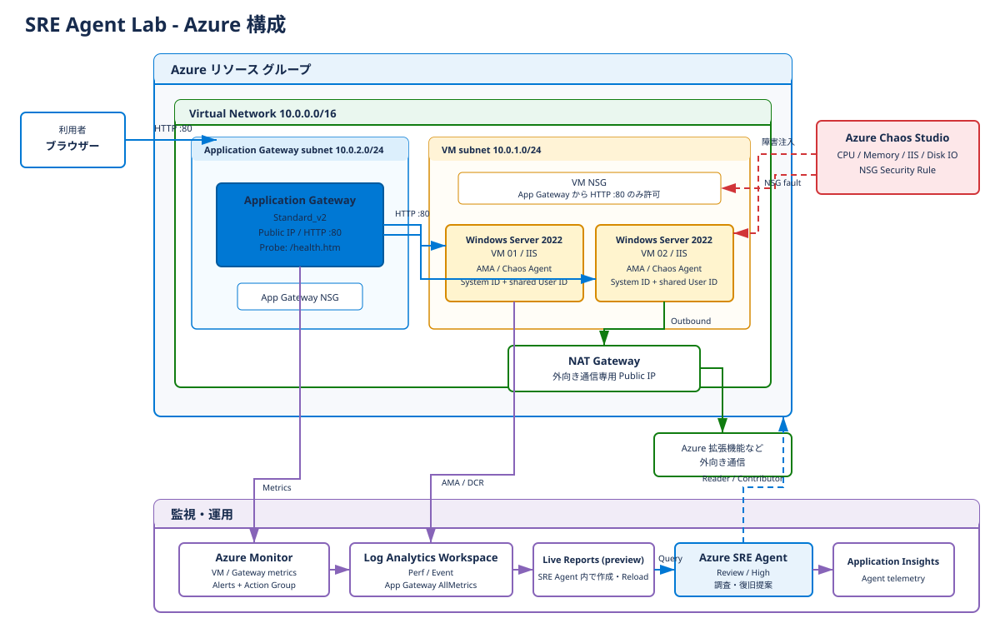

# SRE Agent Lab

Azure SRE Agent と Chaos Studio を使い、Windows Server 2022 の IIS を調査して、承認後に復旧するデモ環境です。
既定では 2 台の VM を Application Gateway の背後に配置します。
本番用の高可用性構成ではなく、削除可能な専用リソースグループで使用してください。

## 構成

[](docs/architecture.drawio)

画像をクリックすると、draw.io で編集できる元図を開けます。

VM の Public IP は既定で作成しません。
NAT Gateway の Public IP は外向き通信専用であり、VM への受信接続には使用できません。
RDP が必要な場合だけ `enableRdpPublicIp=true` と、実際の接続元に限定した `allowedRdpSource`（通常は `/32`）を明示します。
`*` や `/0` を使った公開は避けてください。
管理操作は通常、Azure VM Run Command で行います。

イメージは `MicrosoftWindowsServer:WindowsServer:2022-datacenter-azure-edition:latest`、OS ディスクは **127 GiB / Standard_LRS / caching=None** です。
元イメージより小さい 32 GiB へ縮小できません。
ディスクメトリクスを利用するため、既定の VM サイズは `Standard_D2s_v5` です。
旧 Linux 構成からの OS インプレース変更は対象外です。
旧環境は必要なデータを退避したうえで別の新規リソースグループに構築してください。

## デモで使うシナリオ

| # | シナリオ | 壊し方 (Chaos / Script) | 症状 | 期待する SRE Agent 動作 | 戻し方 |
|---|---|---|---|---|---|
| 1 | CPU 高騰 | Chaos: `run-chaos.sh cpu`、全 VM に 95% / 10 分 | CPU 上昇、応答遅延の可能性 | メトリクスと実験時刻の照合、停止提案 | `run-chaos.sh stop cpu`、CPU と HTTP を確認 |
| 2 | メモリ圧迫 | Chaos: `run-chaos.sh memory`、全 VM に 90% / 10 分 | Available Bytes 低下 | Perf とメモリ不足リスクの分析 | `run-chaos.sh stop memory`、空きメモリを確認 |
| 3 | IIS 停止 | Chaos: `run-chaos.sh iis`、vm-01 の W3SVC / 5 分 | 片系 Unhealthy、残る VM へ転送 | SCM 7036 とプローブを照合、サービス復旧提案 | `run-chaos.sh stop iis`、未復旧なら `fix-iis.sh` |
| 4 | NSG 誤設定 | Chaos: `run-chaos.sh nsg` または Script: `break-nsg.sh` | バックエンド到達不可、502 の可能性 | 規則差分と影響確認、所有者に応じた復旧提案 | Chaos は `stop nsg`、手動版は `fix-nsg.sh` |
| 5 | ディスク IO 圧迫 | Chaos: `run-chaos.sh diskio`、vm-01 / 10 分 | IOPS 消費率とキュー増大、遅延の可能性 | OS ディスク制約と VM 制約の切り分け | `run-chaos.sh stop diskio`、IO と HTTP を確認 |
| 6 | App Gateway プローブ誤設定 | Script: `break-appgw-probe.sh`、`/health.htm` → `/healthz` | 全バックエンド Unhealthy、502 | 正常な IIS と誤ったプローブパスを切り分け | `fix-appgw-probe.sh`、Healthy と HTTP 200 を確認 |
| 7 | 定期タスク | 障害注入なし、ポータルで日次タスクを作成 | コストと変更履歴のレポート | 読み取り専用で要約し、根拠と未取得データを示す | デモ用タスクを無効化または削除 |
| 8 | ライブレポート | 障害注入なし、SRE Agent の **ライブ レポート** で状態ダッシュボードをチャットから作成 | 全 VM と Gateway のメトリクス、IIS 停止イベント、実験履歴、アラートを保存済みレポートで一覧化 | 読み取り専用ツールでレポートを作成・保存し、再読み込みで最新化。チャットで直近 30 分の原因候補と証拠を報告 | 不要ならレポートを削除（復旧操作なし） |

NSG の手動版 `ManualDenyAppGatewayHTTP` と Chaos 版 `ChaosDenyAppGatewayHTTP` は、どちらも優先度 100 を使用します。
**同時に実行せず、SRE Agent の手動修復デモには手動版を選ぶか、Chaos を停止してから調査結果を再確認します。**
実験中に外部から NSG を編集すると、実験が失敗することがあります。
NSG SecurityRule 1.0 は既存フローを切断しないため、症状の発生が遅れる場合があります。

## 前提条件とパラメータ

- Bash、Azure CLI（`az`）、Bicep CLI、`python3` とデプロイ用の `mktemp` を用意します。Windows では Git Bash または WSL を使用します。
- `jq` は補助的な JSON 確認用に利用できます。現在の運用スクリプトの JSON 解析は `python3` を使用します。
- `az login` 後、対象サブスクリプションを確認します。
- デプロイ対象 RG にリソース作成権限とロール割り当て権限が必要です。RG の作成やプロバイダー登録は管理者と調整します。
- Azure SRE Agent の利用可否、リージョン、VM クォータを事前に確認します。

| パラメータ | 既定値 / 制約 |
|---|---|
| `prefix` | `srelab`、1～9 文字。英字で始まり英数字で終わる英数字とハイフン。生成する Windows コンピューター名を 15 文字以下にする |
| `vmCount` | `2`、1～99。`1` では IIS 停止時にフェイルオーバー先がない |
| `vmSize` | `Standard_D2s_v5`。変更時はディスク指標の対応を確認 |
| `adminUsername` / `adminPassword` | 管理者名を設定。パスワードはパラメータファイルに保存しない |
| `alertEmail` | 実際の通知先に変更 |
| `deployerPrincipalId` | `az ad signed-in-user show --query id -o tsv` で取得 |
| `enableRdpPublicIp` / `allowedRdpSource` | `false` / `127.0.0.1/32`。RDP 有効化時は接続元の狭い CIDR を明示 |
| `tags` | `project=sreagentlab`、`env=demo`。タグ対応リソースへ適用 |
| `sreAgentAccessLevel` / `sreAgentMode` | `High` / `Review`。読み取り専用デモは `Low` / `ReadOnly` を検討 |

## クイックスタート

以下はリポジトリのルートから Bash で実行する手順です。
`main.parameters.json` をローカル用にコピーし、通知先と利用者 ID などを編集します。
コミット対象とローカル用のどちらも `adminPassword.value` は空文字のままにします。

```bash
cp main.parameters.json main.parameters.local.json
az ad signed-in-user show --query id -o tsv

export RESOURCE_GROUP="rg-sreagentlab"
export LOCATION="eastus2"
bash scripts/deploy.sh
```

`deploy.sh` は実行時に `read -s` でパスワードを受け取り、アクセスを制限した一時パラメータファイルを使い、終了時の `trap` で削除します。
一時ファイルはリポジトリ内に作成します。
Windows ではプライベートな NTFS 作業フォルダーを使用し、ファイル ACL も確認します。
パスワードを表示せず、コマンドライン、シェル履歴、`set -x`、`bash -v`、ログに残さないでください。
ファイルにパスワードを記入する例は提供しません。

| 環境変数 | 用途 |
|---|---|
| `RESOURCE_GROUP` | 既定は `rg-sreagentlab` |
| `LOCATION` | 既定は `eastus2` |
| `SUBSCRIPTION_ID` | 必要時に対象サブスクリプションを指定。未指定なら現在の Azure CLI アカウントを使用 |
| `PARAMETERS_FILE` | 明示指定が優先。未指定なら `main.parameters.local.json`、なければ `main.parameters.json` |
| `DEPLOYMENT_NAME` | 必要時のみ指定。運用スクリプトは未指定なら成功した main デプロイを outputs から自動検出 |

デプロイ後に表示される **Gateway URL** と **SRE Agent のリンク**を開きます。
IIS ページにはホスト名と VM ごとに異なる背景色が表示されます。
繰り返し更新して両 VM の応答を確認してください。
Cookie affinity は無効ですが、リクエストごとに必ず交互に表示される保証はありません。
続いて SRE Agent の **ライブ レポート** で状態ダッシュボードを作成します（[ライブレポート](docs/live-report.md)）。

```bash
bash scripts/run-chaos.sh cpu          # start cpu の短縮形
bash scripts/run-chaos.sh status cpu
bash scripts/run-chaos.sh stop cpu
```

`cpu` を `memory`、`iis`、`diskio`、`nsg` に置き換えて使用できます。
障害は 1 種類ずつ実行し、[デモ手順](docs/demo-scenario.md)で復旧を確認します。

## ファイル構成

```text
main.bicep / main.parameters.json
modules/
  network.bicep / vm.bicep / appgw.bicep
  monitoring.bicep / chaos.bicep / sre-agent.bicep
  activity-log.bicep
scripts/
  setup-iis.ps1 / common.sh / deploy.sh / run-chaos.sh
  break-nsg.sh / fix-nsg.sh
  break-appgw-probe.sh / fix-appgw-probe.sh / fix-iis.sh
  enable-activity-log.sh / cleanup.sh
tests/test_scripts.py / tests/test_templates.py
docs/
  demo-scenario.md / sre-agent-setup.md / runbook-template.md
  azure-portal-manual-setup.md / scheduled-tasks.md / live-report.md
```

## 監視とコストの注意

状態ダッシュボードには、SRE Agent の[ライブレポート (プレビュー)](https://learn.microsoft.com/azure/sre-agent/live-reports)を使用します。
ライブレポートはデプロイ後にエージェントのポータルでチャットから作成するもので、Bicep ではデプロイしません（Azure Monitor ブックは使用しません）。
エージェントは組み込みの Azure Monitor メトリクスと、LAW に取り込んだゲストの `Perf` / `Event` を使ってレポートを表示します。
App Gateway の診断設定は `AllMetrics` のみで、アクセスログなどの有効化は不要です。
レポートは最大 5 分間キャッシュされた結果を表示する場合があるため、デモ中は **再読み込み** を選びます。
レポートの作成と更新は AAU を消費します。データ取得だけの再読み込みは AAU を消費しませんが、モデルによる要約を含めると再読み込みのたびに消費します。
実験開始履歴の `AzureActivity` は、省略可能な `enable-activity-log.sh` によるサブスクリプション診断設定と取り込み待ちが必要です。
手順と権限は[ライブレポート](docs/live-report.md)と[定期タスク](docs/scheduled-tasks.md)を参照してください。

VM を停止しても、Application Gateway、NAT Gateway、Public IP、ディスクなどの料金は継続します。
料金はリージョンと利用時間で変わるため、固定の合計金額を前提にしないでください。
デモ用スケジュールを止め、必要な記録を保存してから、削除対象を確認して実行します。

```bash
bash scripts/cleanup.sh
```

RG 外の任意のサブスクリプション診断設定は RG の削除では消えません。
`cleanup.sh` は `sreagentlab-activity-${RESOURCE_GROUP}` という**正確な名前と送信先 LAW**を照合し、一致する任意の設定だけを先に削除してから RG 削除を要求します。
確認時は RG 名を入力し、サブスクリプション診断設定を検査できない場合や送信先が異なる場合は、削除せず停止します。
RG 削除要求の受付と削除完了は別なので、スクリプトが表示する `az group exists` で完了を確認してください。
ポータルで別名の診断設定を作成した場合は、その設定を管理者が別途確認します。
共有診断設定を一括削除しないでください。

## ローカル検証

```bash
az bicep build --file main.bicep
az bicep build --file modules/activity-log.bicep
az bicep lint --file main.bicep
python3 -m unittest discover -s tests -v
```

テストには Azure CLI / Bicep、Python 3、Bash が必要です。
スクリプトテストは Azure CLI をモックし、実際のリソースを変更しません。
テンプレートテストは一時ディレクトリへビルドし、VM・フォールト・プローブ・監視・RBAC の生成設定を確認します。
ビルドとローカルテストの成功は、サブスクリプションのポリシー、クォータ、SKU の在庫、実際の障害・復旧動作を保証しません。
新規専用 RG へのデプロイ後に[デモ手順](docs/demo-scenario.md)で確認してください。

## ドキュメント

- [8 シナリオのデモ手順](docs/demo-scenario.md)
- [SRE Agent のセットアップと権限](docs/sre-agent-setup.md)
- [Runbook と承認付き修復](docs/runbook-template.md)
- [Windows 構成のポータル手動構築](docs/azure-portal-manual-setup.md)
- [毎朝 9 時 JST の定期タスク](docs/scheduled-tasks.md)
- [SRE Agent のライブレポート](docs/live-report.md)
