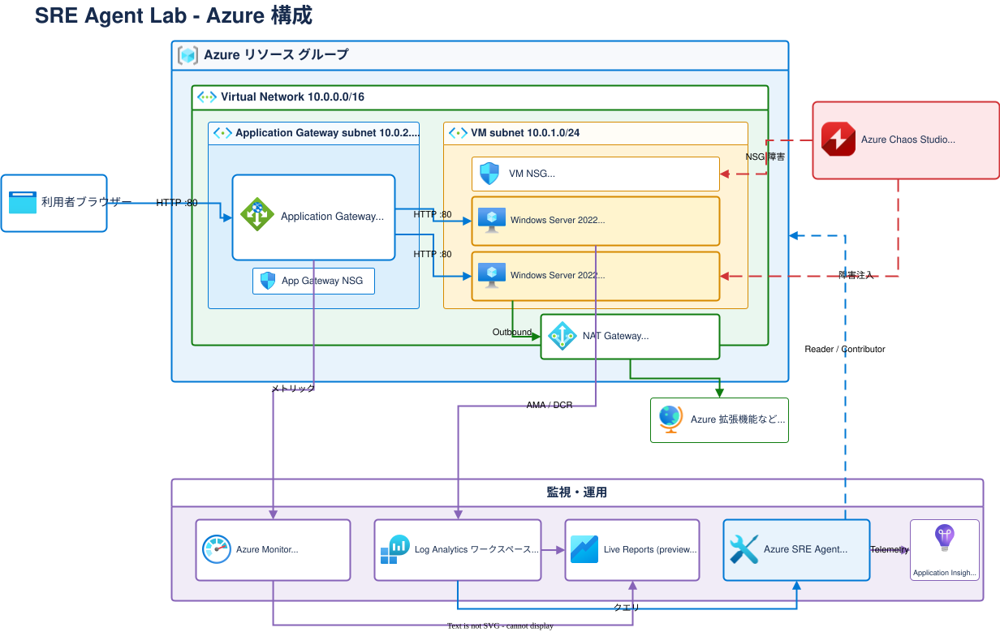
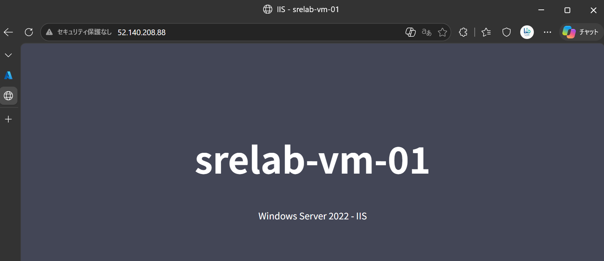

# SRE Agent Lab

Azure SRE Agent と Chaos Studio を使い、Windows Server 2022 の IIS を調査して、承認後に復旧するデモ環境です。
既定では 2 台の VM を Application Gateway の背後に配置します。
本番用の高可用性構成ではなく、削除可能な専用リソースグループで使用してください。

## ドキュメントの読み方

次の順番で読み進めてください。

### 1. 設定手順 (SRE Agent を含む)

1. [前提条件とパラメータ](#前提条件とパラメータ)を確認
2. [Deploy to Azure でデプロイ](#1-deploy-to-azure-でデプロイ)し、Web ページの表示を確認
3. [SRE Agent ステップバイステップ ハンズオン](docs/sre-agent-hands-on.md)を Level 1 から順に進め、単一エージェント、サブエージェントとスキル、ナレッジベースを段階的に設定
4. ポータル項目や詳細なプロンプトは[SRE Agent のセットアップ リファレンス](docs/sre-agent-setup.md)で確認
5. 任意: シナリオ 7 を行う場合は[SRE Agent セットアップの定期タスク手順](docs/sre-agent-setup.md#手順-5-毎朝-9-時-jst-の定期タスクを作成)で権限と Activity Log 転送を準備

### 2. 検証実施手順

1. [8 シナリオのデモ手順](docs/demo-scenario.md)に沿って、1 シナリオずつ障害注入・調査・復旧を実施
2. 承認付き修復は[Runbook](docs/runbook-template.md)に従って実施・記録
3. 終了後は[監視とコストの注意](#監視とコストの注意)に従ってリソースを削除

### 3. 参考資料

- [Azure CLI でデプロイ](#azure-cli-でデプロイ)（Deploy to Azure の代わりにローカルスクリプトを使う場合）
- [Azure portal で手動構築](docs/azure-portal-manual-setup.md)（テンプレートを使わずに構築する場合）
- [ローカル検証](#ローカル検証)（テンプレートとスクリプトを変更した場合）
- [ファイル構成](#ファイル構成)

## 構成

[](docs/imgs/architecture.drawio)

画像をクリックすると、draw.io で編集できる元図を開けます。

VM の Public IP は既定で作成しません。
NAT Gateway の Public IP は外向き通信専用であり、VM への受信接続には使用できません。
RDP が必要な場合だけ `enableRdpPublicIp=true` と、実際の接続元に限定した `allowedRdpSource`（通常は `/32`）を明示します。
`*` や `/0` を使った公開は避けてください。
管理操作は通常、Azure VM Run Command で行います。

イメージは `MicrosoftWindowsServer:WindowsServer:2022-datacenter-azure-edition:latest`、OS ディスクは **127 GiB / Standard_LRS / caching=None** です。
元イメージより小さい 32 GiB へ縮小できません。
既定の VM サイズは、2 vCPU / 8 GiB を維持しながら費用を抑える `Standard_B2ms` です。
バースト可能 SKU のため、長時間の連続 CPU 負荷では CPU クレジットの影響を受けます。
デプロイ先で SKU の在庫と、ラボで使うディスクメトリクスを確認してください。
旧 Linux 構成からの OS インプレース変更は対象外です。
旧環境は必要なデータを退避したうえで別の新規リソースグループに構築してください。

## デモで使うシナリオ

| # | シナリオ | 壊し方 (Chaos / Script) | 症状 | 期待する SRE Agent 動作 | 戻し方 |
|---|---|---|---|---|---|
| 1 | CPU 高騰 | Chaos: `run-chaos.sh cpu`、全 VM に 95% / 10 分 | CPU 上昇、応答遅延の可能性 | メトリクスと実験時刻の照合、停止提案 | `run-chaos.sh stop cpu`、CPU と HTTP を確認 |
| 2 | メモリ圧迫 | Chaos: `run-chaos.sh memory`、全 VM に 90% / 10 分 | Available Bytes 低下 | Perf とメモリ不足リスクの分析 | `run-chaos.sh stop memory`、空きメモリを確認 |
| 3 | IIS 停止 | Chaos: `run-chaos.sh iis`、vm-01 の W3SVC / 5 分 | 片系 Unhealthy、残る VM へ転送 | イベント ID 7036 の確認とプローブを照合、サービス復旧提案 | `run-chaos.sh stop iis`、未復旧なら `fix-iis.sh` |
| 4 | NSG 誤設定 | Script: `break-nsg.sh` | バックエンド到達不可、502 の可能性 | 規則差分と影響確認、手動規則の復旧提案 | `fix-nsg.sh` |
| 5 | ディスク IO 圧迫 | Chaos: `run-chaos.sh diskio`、vm-01 / 10 分 | IOPS 消費率とキュー増大、遅延の可能性 | OS ディスク制約と VM 制約の切り分け | `run-chaos.sh stop diskio`、IO と HTTP を確認 |
| 6 | App Gateway プローブ誤設定 | Script: `break-appgw-probe.sh`、`/health.htm` → `/healthz` | 全バックエンド Unhealthy、502 | 正常な IIS と誤ったプローブパスを切り分け | `fix-appgw-probe.sh`、Healthy と HTTP 200 を確認 |
| 7 | 定期タスク | 障害注入なし、ポータルで日次タスクを作成 | コストと変更履歴のレポート | 読み取り専用で要約し、根拠と未取得データを示す | デモ用タスクを無効化または削除 |
| 8 | ライブレポート | 障害注入なし、SRE Agent の **ライブ レポート** で状態ダッシュボードをチャットから作成 | 全 VM と Gateway のメトリクス、IIS 停止イベント、実験の操作履歴、アラートルールの構成変更履歴（発報状態ではない）を一覧化 | 読み取り専用ツールでレポートを作成・保存し、再読み込みで最新化。チャットで直近 30 分の原因候補と証拠を報告 | 不要ならレポートを削除（復旧操作なし） |

NSG 誤設定では、`break-nsg.sh` が優先度 100 の `ManualDenyAppGatewayHTTP` を作成します。
既存フローの状態やプローブ間隔により、症状の発生が遅れる場合があります。

## 前提条件とパラメータ

- **Deploy to Azure** を使う場合、必要なのは Web ブラウザと Azure portal へのサインインだけです。
- ローカルスクリプトを使う場合は、Bash、Azure CLI（`az`）、Bicep CLI、`python3` とデプロイ用の `mktemp` を用意します。Windows では Git Bash または WSL を使用します。
- `jq` は補助的な JSON 確認用に利用できます。現在の運用スクリプトの JSON 解析は `python3` を使用します。
- ローカルスクリプトでは `az login` 後、対象サブスクリプションを確認します。
- デプロイ対象 RG にリソース作成権限とロール割り当て権限が必要です。RG の作成やプロバイダー登録は管理者と調整します。
- Azure SRE Agent の利用可否、リージョン、VM クォータを事前に確認します。

| パラメータ | 既定値 / 制約 |
|---|---|
| `prefix` | `srelab`、1～9 文字。英字で始まり英数字で終わる英数字とハイフン。生成する Windows コンピューター名を 15 文字以下にする |
| `vmCount` | `2`、1～99。`1` では IIS 停止時にフェイルオーバー先がない |
| `vmSize` | `Standard_B2ms`（2 vCPU / 8 GiB）。変更時はメモリアラート閾値とディスク指標の対応を確認 |
| `enableAutoShutdown` | `true`。毎日の VM 自動停止（割り当て解除）を無効にする場合だけ `false` |
| `autoShutdownTime` / `autoShutdownTimeZone` | `1900` / `Tokyo Standard Time`。毎日 19:00 JST に停止し、起動は手動 |
| `adminUsername` / `adminPassword` | 管理者名を設定。パスワードはパラメータファイルに保存しない |
| `alertEmail` | 実際の通知先に変更 |
| `deployerPrincipalId` | Microsoft Entra ID のユーザー画面にある **オブジェクト ID**。CLI では `az ad signed-in-user show --query id -o tsv` で取得 |
| `lawName` | `<prefix>-law-<ランダム 6 文字>`。削除したリソースグループを再作成した際に、論理削除中のワークスペースが復元されるのを避ける。既存環境へ再デプロイするときは出力 `lawName` の値を指定する（未指定だと新しいワークスペースが作られる） |
| `enableRdpPublicIp` / `allowedRdpSource` | `false` / `127.0.0.1/32`。RDP 有効化時は接続元の狭い CIDR を明示 |
| `tags` | `project=sreagentlab`、`env=demo`。タグ対応リソースへ適用 |
| `sreAgentAccessLevel` / `sreAgentMode` | 既定値はそれぞれ `High` / `Review`。読み取り専用デモでは、それぞれ `Low` / `ReadOnly` を検討 |

## 設定手順

### 1. Deploy to Azure でデプロイ

[](https://portal.azure.com/#create/Microsoft.Template/uri/https%3A%2F%2Fraw.githubusercontent.com%2Fyuriwoof%2Fsreagentlab%2Fmain%2Fazuredeploy.json)

ボタンを選び、サブスクリプションとリソース グループを指定して、少なくとも次の値を入力します。Bicep、Azure CLI、Bash は不要です。
このボタンは、公開 GitHub リポジトリの [`azuredeploy.json`](azuredeploy.json) を Azure portal が取得してデプロイします。

- **Admin Password**: 12～123 文字で 3 種類以上の文字種を含み、管理者名を含まない Windows 管理者パスワード
- **Alert Email**: Azure Monitor アラートの通知先
- **Deployer Principal Id**: Microsoft Entra ID → **ユーザー** → 自分のユーザーに表示される **オブジェクト ID**

RDP を有効にする場合は、**Allowed Rdp Source** を自分の接続元だけに限定した IPv4 CIDR に変更します。`/0`、ワイルドカード、ループバックは使用しません。
デプロイには、対象リソースを作成する権限に加えてロール割り当て権限が必要です。プロバイダー登録やリソース グループ作成が許可されていない場合は管理者へ依頼してください。

デプロイが完了すると、以下のように AppGW に割り当てたパブリック IP アドレスを Web ブラウザで開くと、展開した HTML ファイルを表示できます。



アクセス先は、デプロイ出力 `appGwPublicIp` またはパブリック IP アドレス `<prefix>-appgw-pip` の IP アドレスを使った `http://<IP アドレス>/` です。
IIS ページにはホスト名と VM ごとに異なる背景色が表示されます。
繰り返し更新して両 VM の応答を確認してください。
Cookie affinity は無効ですが、リクエストごとに必ず交互に表示される保証はありません。

#### 任意: Activity Log を Log Analytics に転送

定期タスクなどで LAW の `AzureActivity` から Chaos 実験の開始履歴や構成変更を参照する場合は、環境のデプロイ後に Activity Log の転送を有効にします。標準のライブレポートは `system-mcp-monitor_monitor_activitylog_list` で Activity Log を直接読むため、転送は不要です。
通常のデプロイには含まれないオプションです。

この操作には Bash、Azure CLI、Python 3 と、対象サブスクリプションで診断設定を作成できる権限が必要です。
`az login` 後、リポジトリのルートで実行してください。

```bash
bash scripts/enable-activity-log.sh
```

ラボのリソースグループが複数ある場合や既定名以外の場合は、対象を明示します。

```bash
RESOURCE_GROUP=<RG 名> SUBSCRIPTION_ID=<サブスクリプション ID> bash scripts/enable-activity-log.sh
```

スクリプトは成功した main デプロイの出力から LAW を特定し、サブスクリプションの Activity Log をその LAW に送る診断設定を作成します。
転送前の履歴は取り込まれず、反映には数分かかる場合があります。また、LAW のデータ取り込み費用が発生する可能性があります。
このため、シナリオ 7 など `AzureActivity` を LAW で検索する場合だけ有効にしてください。
標準のライブレポートで表示するアラートルールの構成変更履歴は、発報状態の `Fired` / `Resolved` とは異なります。発報状態は Azure Monitor のアラート画面で確認してください（[ライブレポートのプロンプトと制約](docs/sre-agent-setup.md#手順-3-ライブレポートで状態ダッシュボードを作成)）。
別名の診断設定が既に同じ LAW に Activity Log を転送している場合、スクリプトは重複を避けるため停止します。

診断設定はラボ RG の外にあるため、RG を直接削除しても残ります。
終了時は `scripts/cleanup.sh` を使用すると、このラボ用の設定名と送信先 LAW が一致する場合に限り、診断設定を先に削除します。
権限とデータの扱いは[SRE Agent セットアップの定期タスク手順](docs/sre-agent-setup.md#手順-5-毎朝-9-時-jst-の定期タスクを作成)を確認してください。

### 2. SRE Agent の設定

1. デプロイ出力 `sreAgentPortalUrl` を開きます。
2. [ステップバイステップ ハンズオン](docs/sre-agent-hands-on.md)の共通準備を実施します。
3. Level 1 で Review モードの対応計画を作成し、単一エージェントの調査を確認します。
4. Level 2 で 1 つのカスタム エージェントと、調査・修復の 2 つのスキルを作成します。
5. Level 3 でラボ固有のナレッジを登録し、出典付きの回答を確認します。
6. ライブレポートや定期タスクも試す場合は、[詳細セットアップ](docs/sre-agent-setup.md)に従います。

## 監視とコストの注意

状態ダッシュボードには、SRE Agent の[ライブレポート (プレビュー)](https://learn.microsoft.com/azure/sre-agent/live-reports)を使用します。
ライブレポートはデプロイ後にエージェントのポータルでチャットから作成するもので、Bicep ではデプロイしません（Azure Monitor ブックは使用しません）。
エージェントは組み込みの Azure Monitor メトリクスと、LAW に取り込んだゲストの `Perf` / `Event` を使ってレポートを表示します。
App Gateway の診断設定は `AllMetrics` のみで、アクセスログなどの有効化は不要です。
レポートは最大 5 分間キャッシュされた結果を表示する場合があるため、デモ中は **再読み込み** を選びます。
レポートの作成と更新は AAU を消費します。データ取得だけの再読み込みは AAU を消費しませんが、モデルによる要約を含めると再読み込みのたびに消費します。
LAW の `AzureActivity` に実験開始履歴を取り込む場合だけ、省略可能な `enable-activity-log.sh` によるサブスクリプション診断設定と取り込み待ちが必要です。標準のライブレポートは Activity Log を直接照会します。
手順と権限は[SRE Agent のセットアップ](docs/sre-agent-setup.md)を参照してください。

VM は既定で毎日 19:00 JST に自動停止され、**停止済み（割り当て解除）**になります。
30 分前の通知は `alertEmail` に送信されます。翌日に自動起動はせず、必要なときだけ Azure portal から開始するか、専用 RG の全 VM を CLI で開始します。

```bash
mapfile -t VM_IDS < <(az vm list --resource-group "$RESOURCE_GROUP" --query '[].id' -o tsv)
((${#VM_IDS[@]} > 0)) && az vm start --ids "${VM_IDS[@]}" --no-wait
```

開始操作自体に追加手数料はありませんが、開始後の VM 稼働時間は課金されます。
VM を停止しても、Application Gateway、NAT Gateway、Public IP、ディスクなどの料金は継続します。
料金はリージョンと利用時間で変わるため、固定の合計金額を前提にしないでください。

### 東日本で 7 日間保持する場合の概算

2026-10-09 に [Azure Retail Prices API](https://prices.azure.com/api/retail/prices) で確認した東日本 (`japaneast`) の従量課金単価に基づく、既定構成を 7 日間（168 時間）連続稼働した場合の参考値です。契約割引、Azure クレジット、為替、消費税は含みません。

| リソース | 前提 | 7 日間の概算 (USD) |
|---|---|---:|
| Windows VM | `Standard_B2ms` × 2、$0.136/時間 | $45.70 |
| Application Gateway | Standard_v2 固定費、$0.29/時間 | $48.72 |
| Application Gateway 容量ユニット | 1 CU、$0.01/時間 | $1.68 |
| NAT Gateway | 1 台、約 $0.045/時間 | $7.56 |
| Standard Static Public IP | 2 個、$0.01/時間/個 | $3.36 |
| Standard HDD OS ディスク | S10（127 GiB OS ディスク相当）× 2、$5.89/月/個を 168/730 時間で按分 | $2.71 |
| **固定費合計** |  | **約 $109.73** |

VM のサイズ変更だけで、旧構成の固定費約 $136.61 から 7 日あたり約 $26.88（約 20%）削減します。
さらに毎日 09:00 に手動起動して 19:00 に自動停止する例では、VM は 1 日 10 時間だけ課金され、VM 費は約 $19.04、固定費合計は約 $83.07 です。実際の金額は手動起動時刻で変わります。

Log Analytics の `Perf` / `Event` および Application Gateway メトリクスは取り込み量に応じて課金されます。性能カウンターは 10 秒間隔から 30 秒間隔へ変更し、`Perf` の取り込みを抑えています。東日本の Log Analytics 取り込み単価は $3.34/GB です。連続稼働で 1 週間に 1 GB を取り込む場合、合計は **約 $113.07** です。$1 = 150 円で換算した参考値は、約 **16,500～17,000 円**です。

この概算には、通信量、NAT Gateway のデータ処理量、Application Gateway の追加容量ユニット、Azure Monitor のクエリ・アラート、Chaos Studio の実験実行、SRE Agent の AAU 消費を含めません。Chaos Studio は東日本で $0.10/アクション分です。特に `enable-activity-log.sh` でサブスクリプション Activity Log の転送を有効にすると、LAW の取り込み量が増加します。デプロイ後は Cost Management の実績で確認してください。

### リソース別の削減判断

| リソース | 判断 |
|---|---|
| VM | `Standard_B2ms` へ縮小し、毎日 19:00 JST に割り当て解除。長時間 CPU 負荷ではバーストクレジットに注意 |
| Application Gateway | Standard_v2 はプローブ障害演習の中核なので維持。低価格の Basic はプレビュー、リージョン提供状況、プローブ互換性を検証できた場合の追加候補 |
| NAT Gateway | VM Extension、Azure Monitor Agent、Chaos Agent の外向き通信に必要なため維持。削除には Private Link 等を含む再設計が必要 |
| Public IP | Application Gateway と NAT Gateway の 2 個だけを維持。VM の RDP Public IP は既定で無効 |
| OS ディスク | イメージが 127 GiB を必要とし、既に Standard HDD を使用しているため維持。VM 割り当て解除中も課金 |
| Log Analytics | `Perf` を 30 秒間隔に抑制。30 日保持、Event 7036、App Gateway の AllMetrics は演習用に維持 |
| Chaos Studio | 必要な実験だけ手動実行し、不要な反復実行を避ける |
| SRE Agent | モデル要約付きライブレポート更新と不要な定期タスクを避け、AAU 消費を抑える |

デモ用スケジュールを止め、必要な記録を保存してから、削除対象を確認して実行します。

```bash
bash scripts/cleanup.sh
```

RG 外の任意のサブスクリプション診断設定は RG の削除では消えません。
`cleanup.sh` は `sreagentlab-activity-${RESOURCE_GROUP}` という**正確な名前と送信先 LAW**を照合し、一致する任意の設定だけを先に削除してから RG 削除を要求します。
確認時は RG 名を入力し、サブスクリプション診断設定を検査できない場合や送信先が異なる場合は、削除せず停止します。
RG 削除要求の受付と削除完了は別なので、スクリプトが表示する `az group exists` で完了を確認してください。
ポータルで別名の診断設定を作成した場合は、その設定を管理者が別途確認します。
共有診断設定を一括削除しないでください。

## 参考資料

### Azure CLI でデプロイ

Deploy to Azure の代わりに、リポジトリのルートから Bash でデプロイする手順です。
`main.parameters.json` をローカル用にコピーし、通知先と利用者 ID などを編集します。
コミット対象とローカル用のどちらも `adminPassword.value` は空文字のままにします。

```bash
cp main.parameters.json main.parameters.local.json
az ad signed-in-user show --query id -o tsv

export RESOURCE_GROUP="rg-sreagentlab"
export LOCATION="japaneast"
bash scripts/deploy.sh
```

`deploy.sh` は実行時に `read -s` でパスワードを受け取り、アクセスを制限した一時パラメータファイルを使い、終了時の `trap` で削除します。
一時ファイルはリポジトリ内に作成します。
Windows ではプライベートな NTFS 作業フォルダーを使用し、ファイル ACL も確認します。
パスワードを表示せず、コマンドライン、シェル履歴、`set -x`、`bash -v`、ログに残さないでください。
ファイルにパスワードを記入する例は提供しません。

| 環境変数 | 用途 |
|---|---|
| `RESOURCE_GROUP` | `deploy.sh` の既定は `rg-sreagentlab`。運用スクリプトは未指定ならラボの RG を自動検出（複数ある場合は指定が必要） |
| `LOCATION` | 既定は `japaneast` |
| `SUBSCRIPTION_ID` | 必要時に対象サブスクリプションを指定。未指定なら現在の Azure CLI アカウントを使用 |
| `PARAMETERS_FILE` | 明示指定が優先。未指定なら `main.parameters.local.json`、なければ `main.parameters.json` |
| `DEPLOYMENT_NAME` | 必要時のみ指定。運用スクリプトは未指定なら成功した main デプロイを outputs から自動検出 |

デプロイ後に表示される **Gateway URL** で Web ページを確認し、[2. SRE Agent の設定](#2-sre-agent-の設定)に進みます。

### Azure portal で手動構築

テンプレートを使わずに、同じ構成を Azure portal で 1 つずつ作成する手順は[ポータル手動構築](docs/azure-portal-manual-setup.md)を参照してください。

### ローカル検証

```bash
az bicep build --file main.bicep
az bicep build --file modules/activity-log.bicep
az bicep lint --file main.bicep
python3 -m unittest discover -s tests -v
```

テストには Azure CLI / Bicep、Python 3、Bash が必要です。
スクリプトテストは Azure CLI をモックし、実際のリソースを変更しません。
テンプレートテストは一時ディレクトリへビルドし、VM・フォールト・プローブ・監視・RBAC の生成設定を確認します。
ビルドとローカルテストの成功は、サブスクリプションのポリシー、クォータ、SKU の在庫、実際の障害・復旧動作を保証しません。
新規専用 RG へのデプロイ後に[デモ手順](docs/demo-scenario.md)で確認してください。

### ファイル構成

```text
main.bicep / azuredeploy.json / main.parameters.json
modules/
  network.bicep / vm.bicep / appgw.bicep
  monitoring.bicep / chaos.bicep / sre-agent.bicep
  activity-log.bicep
scripts/
  setup-iis.ps1 / common.sh / deploy.sh / run-chaos.sh
  break-nsg.sh / fix-nsg.sh
  break-appgw-probe.sh / fix-appgw-probe.sh / fix-iis.sh
  enable-activity-log.sh / cleanup.sh
tests/test_scripts.py / tests/test_templates.py
docs/
  demo-scenario.md / sre-agent-setup.md / runbook-template.md
  azure-portal-manual-setup.md
```
