# 8 シナリオのデモ手順

## 共通の準備

[README](../README.md)の構成を専用 RG にデプロイし、[SRE Agent](sre-agent-setup.md)を開きます。
デモの前に、SRE Agent のライブレポート「SRE Lab Live Status」を作成しておきます（[ライブレポート](sre-agent-setup.md#手順-2-ライブレポートで状態ダッシュボードを作成)）。
各シナリオの「症状確認」では、このライブレポートをダッシュボードとして使用します。
発報したアラートを SRE Agent に自動で調査させる場合は、[Azure Monitor の接続](sre-agent-setup.md#手順-3-azure-monitor-のアラートを受信する)も済ませておきます。
Gateway URL、全 VM の名前、デプロイ outputs、正常時のメトリクスを記録してください。
既定は Windows IIS 2 台です。
`vmCount=1` の場合、片系障害からのフェイルオーバーを実演できません。

コマンドはリポジトリのルートから Bash で実行します。
`RESOURCE_GROUP` を指定しない場合、運用スクリプトはラボの RG を自動検出します。複数のラボがある場合は指定し、必要時だけ `DEPLOYMENT_NAME` を指定します。
未指定の場合、運用スクリプトは必要な outputs を持つ成功した main デプロイを検出します。
パラメータの prefix から対象リソース名を推測して操作しないでください。

ライブレポートは最大 5 分間キャッシュされた結果を表示する場合があるため、障害注入後と復旧後に **再読み込み** を選びます。
メトリクスの反映、AMA の `Perf` / `Event`、任意の `AzureActivity` の取り込みには遅延があります。
5 分の評価窓があるアラートは、障害開始から必ず 5 分で発報するわけではありません。
前の障害の停止と復旧を確認してから次に進みます。
5 分の評価窓があるアラートは、障害開始から必ず 5 分で発報するわけではありません。
前の障害の停止と復旧を確認してから次に進みます。

## 1. CPU 高騰

### 事前確認

全 VM の `Percentage CPU`、Gateway の正常ホスト数、ブラウザの HTTP 200 を確認します。
CPU 実験は全 VM に 95% の負荷を 10 分間与えます。
Windows の CPU Pressure は `% Processor Utility`（ターボによる周波数上昇を含む）を基準に負荷を調整するため、`Percentage CPU` は 60～75% 程度で横ばいになります。

### 障害注入

```bash
bash scripts/run-chaos.sh start cpu
bash scripts/run-chaos.sh status cpu
```

### 症状確認

全 VM の CPU 上昇と、5 分平均 60% 超の CPU アラートを確認します。
静的な IIS ページでは高負荷でも HTTP 200 を返すことがあるため、必ず停止するわけではありません。

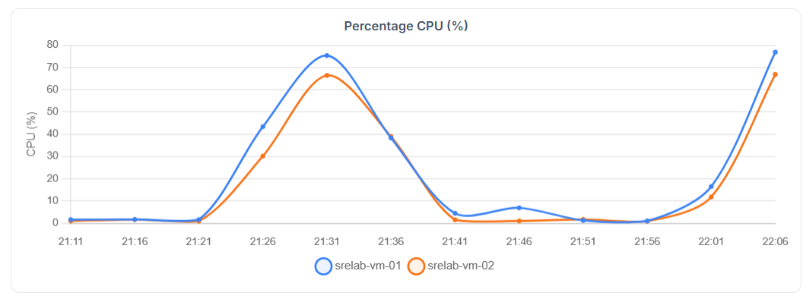

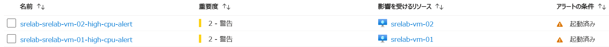

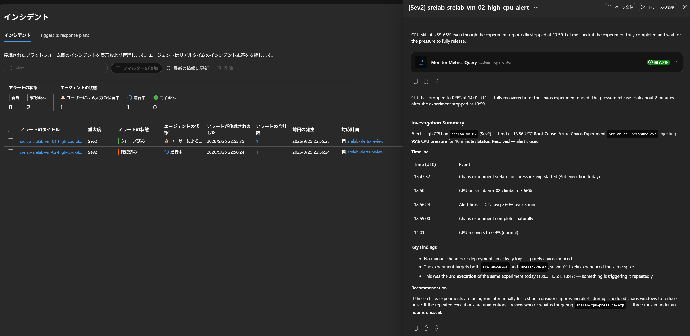

### SRE Agentへの問いかけ例

```text
対象 RG の全 VM の直近 30 分の CPU と Gateway の状態を比較してください。
実験開始時刻との相関、調査に使用した指標、未確認事項を示してください。
推測だけでプロセスを強制終了せず、実験停止を優先する復旧案を提示して承認を待ってください。
```

### 復旧確認

```bash
bash scripts/run-chaos.sh stop cpu
bash scripts/run-chaos.sh status cpu
```

キャンセル要求の送信だけで完了と判断せず、
実験の終了、CPU の低下、HTTP 200、アラート解消を確認します。

## 2. メモリ圧迫

### 事前確認

ライブレポートの VM 別の空きメモリと Log Analytics の `Perf` を確認します。
メモリ実験は全 VM に 90% の負荷を 10 分間与えます。

### 障害注入

```bash
bash scripts/run-chaos.sh start memory
```

### 症状確認

Available Bytes の減少とブラウザの応答を比較します。
メモリアラートは `Perf` の 5 分平均が 3 GiB 未満の場合に発報します。
既定の `Standard_D2s_v5`（8 GiB）では、平常時の空きは約 5.9 GiB、90% 負荷時は約 0.9 GiB です。
VM サイズを小さくすると平常時でも発報する場合があるため、しきい値を見直してください。

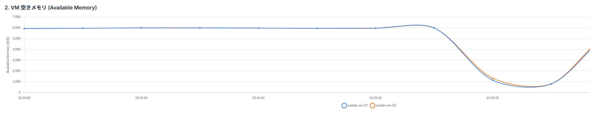

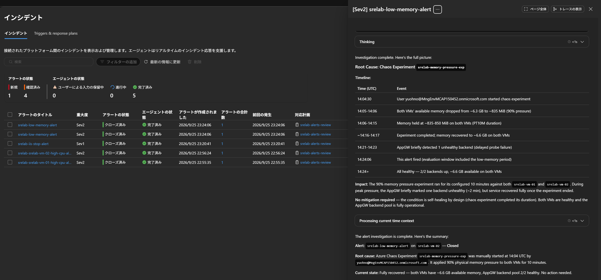

### SRE Agentへの問いかけ例

```text
全 VM の Available Bytes と % Committed Bytes In Use を比較し、メモリ不足リスクを評価してください。
ゲスト Perf の取得時刻と欠損を明示し、実験停止を優先する案を提示してください。
VM のサイズ変更や再起動は実行せず、追加承認が必要な選択肢として扱ってください。
```

### 復旧確認

```bash
bash scripts/run-chaos.sh stop memory
bash scripts/run-chaos.sh status memory
```

空きメモリの回復、HTTP 200、実験の終了を確認します。
アラートが発報しなかった場合も実測値を記録します。

## 3. IIS 停止と片系切り離し

### 事前確認

ブラウザの反復更新で両 VM のホスト名と背景色を確認します。
Cookie affinity 無効は厳密な交互表示の保証ではありません。
IIS 実験は最初の VM（`vm-01`）の `W3SVC` だけを 5 分間停止します。

### 障害注入

```bash
bash scripts/run-chaos.sh iis
```

### 症状確認

プローブ判定後に正常 VM のみへ転送され、通常は HTTP 200 を維持します。
判定まで一時的に失敗する可能性があります。
片系の Unhealthy と Service Control Manager の Event ID 7036 を確認します。
VM が 1 台なら正常な転送先がなく、502 になり得ます。

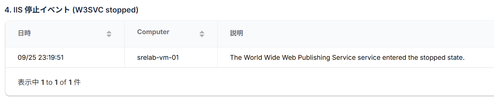

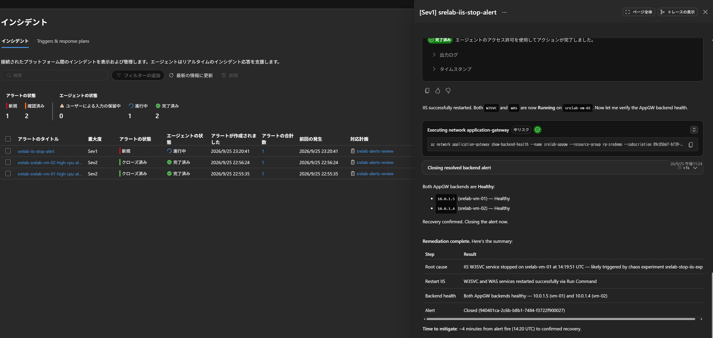

### SRE Agentへの問いかけ例

```text
片系だけが Gateway のバックエンドから外れました。
W3SVC の停止イベント、各 VM の状態、Gateway の HealthyHostCount を照合してください。
実験停止後にサービス状態を Run Command で確認し、必要な場合だけ起動する案を提示してください。
```

### 復旧確認

```bash
bash scripts/run-chaos.sh stop iis
bash scripts/run-chaos.sh status iis
# 実験終了後も W3SVC が停止している場合のみ実行
bash scripts/fix-iis.sh
```

W3SVC が Running、ローカル `/health.htm` が HTTP 200、両バックエンドが Healthy であることを確認します。
過去の停止イベントがライブレポートの表に残ること自体は、現在も停止中であることを意味しません。

## 4. NSG 誤設定

### 事前確認

App Gateway サブネットから VM サブネットへの TCP 80 を許可する優先度 200 の規則を確認します。
優先度 100 の障害規則がない状態から始めます。

### 障害注入

```bash
bash scripts/break-nsg.sh
```

`break-nsg.sh` は優先度 100 の `ManualDenyAppGatewayHTTP` を作成します。

### 症状確認

新規接続やプローブ失敗が反映されると、Unhealthy が増えてブラウザに 502 が返る可能性があります。
確立済みフローの状態やプローブ間隔により、即座に症状が現れない場合があります。
ブラウザからリクエストを送り、frontend 5xx を観測します。
SRE Agent が調査するのは Sev1 の Unhealthy アラートです。frontend 5xx アラートは Sev3 のため通知のみです。
Gateway が生成する 502 は backend 5xx アラートの対象ではありません。

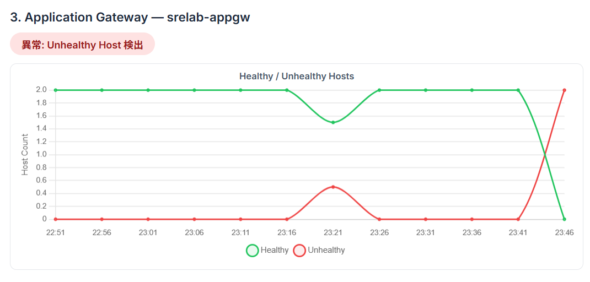
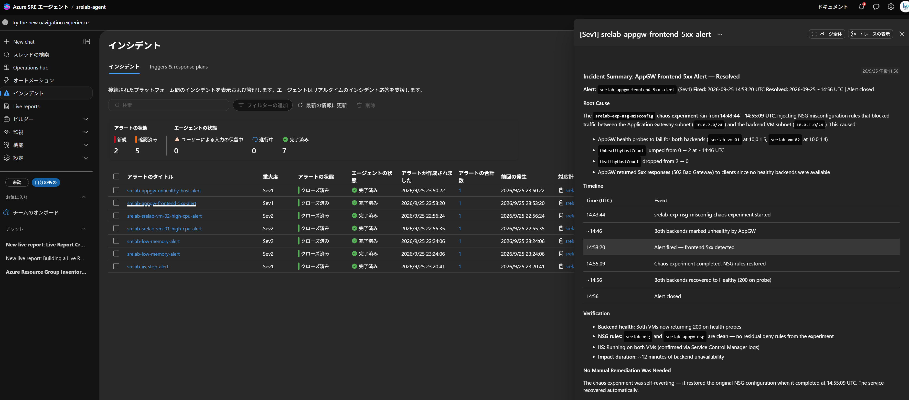

### SRE Agentへの問いかけ例

```text
NSG の HTTP 規則を読み取り、送信元、宛先、ポート、優先度、規則の所有者を確認してください。
ManualDenyAppGatewayHTTP だけを削除する差分を示して承認を待ってください。
```

### 復旧確認

`bash scripts/fix-nsg.sh` で手動規則のみを削除します。
正常な許可規則の維持、Healthy 数の回復、HTTP 200 を確認します。

## 5. ディスク IO 圧迫

### 事前確認

最初の VM の OS ディスクが 127 GiB、Standard_LRS、caching=None であることを確認します。
`DiskIOPressure-1.1` は `C:\ChaosTemp` に対して `PremiumStorageP10IOPS` の負荷モードで 10 分間実行します。

### 障害注入

```bash
bash scripts/run-chaos.sh diskio
```

### 症状確認

`OS Disk IOPS Consumed Percentage`、`OS Disk Queue Depth`、ゲスト `Disk Reads/sec` / `Disk Writes/sec` を正常 VM と比較します。
IOPS 90% 超とキュー深度 10 超のアラートは 5 分平均で評価します。
負荷の実測結果次第で閾値未満になる場合もあります。
`VM Cached IOPS Consumed Percentage` は参考アラートであり、caching=None ではデータが出ない場合があります。

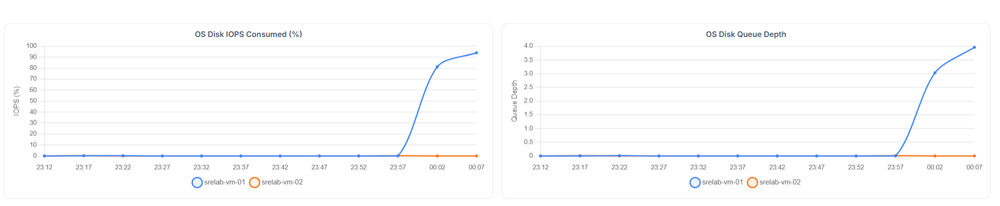
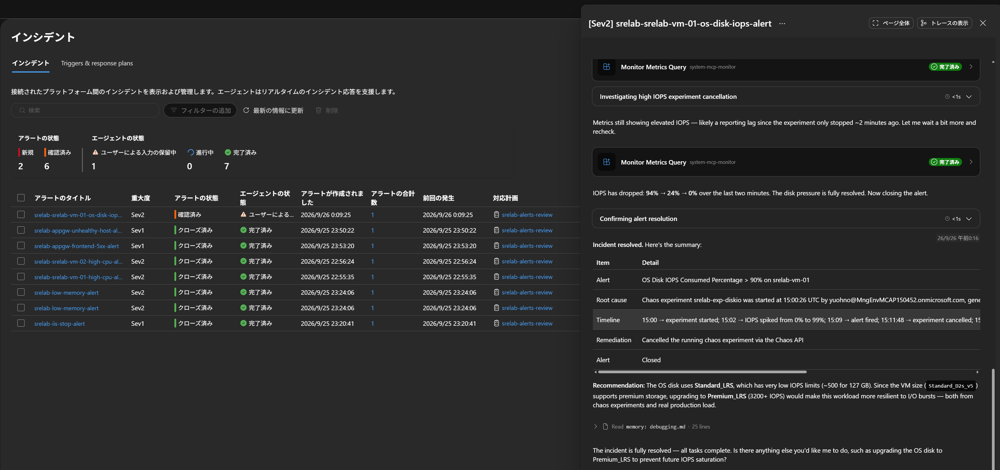

### SRE Agentへの問いかけ例

```text
OS ディスクの IOPS 消費率とキュー、VM 側の上限、ゲスト IO を比較してください。
キャッシュなしのため cached IOPS の欠損を 0 や正常と扱わないでください。
実験停止を優先し、ディスク変更や VM サイズ変更はコスト、停止影響、検証手順を含む提案だけにしてください。
```

### 復旧確認

```bash
bash scripts/run-chaos.sh stop diskio
bash scripts/run-chaos.sh status diskio
```

IOPS とキューがベースラインへ戻り、HTTP 200 とバックエンド正常数が維持されることを確認します。
ファイルやディスクを破壊的に削除して復旧しないでください。

## 6. App Gateway プローブ誤設定

### 事前確認

プローブ `iis-health` が `/health.htm`、正常応答が HTTP 200 であることを確認します。
スクリプトは既知の `/health.htm` と `/healthz` の間だけを変更し、想定外のカスタムパスは拒否します。

### 障害注入

```bash
bash scripts/break-appgw-probe.sh
```

### 症状確認

存在しない `/healthz` の応答により全バックエンドが Unhealthy となり、Gateway が 502 を返すことを確認します。
VM のローカル `/health.htm` が正常であることと対比します。
リクエストを送らない場合、frontend 5xx のサンプルは増えません。

### SRE Agentへの問いかけ例

```text
IIS は稼働中ですが Gateway が 502 を返しています。
プローブのパスとローカル health.htm の応答、NSG、Backend health を照合してください。
既知の変更 /healthz → /health.htm のみを戻す差分を示し、承認を待ってください。
```

### 復旧確認

```bash
bash scripts/fix-appgw-probe.sh
```

更新完了とプローブ周期を待ち、両バックエンドの Healthy、HTTP 200、反復更新時の両 VM の応答を確認します。

## 7. 定期タスク

### 事前確認

[定期タスク手順](scheduled-tasks.md)でコスト用 API 権限と、変更履歴用の任意の Activity Log エクスポートを確認します。
過去の障害をすべて復旧し、読み取り専用のプロンプトを使用します。

### 障害注入

障害は注入しません。
SRE Agent ポータルで毎朝 9 時 JST のコスト報告と変更履歴報告のタスクを作成します。
この手順はデモ担当者による作成手順であり、ライブレポートを開くだけではスケジュールを作成しません。

### 症状確認

タスク一覧の次回実行時刻と、実行後の会話スレッドを確認します。
ブラウザの IIS とライブレポートが正常であることも確認します。
データ未到着、権限不足、取得失敗は「問題なし」ではなく未確認事項として報告させます。

### SRE Agentへの問いかけ例

```text
日次報告に含まれる費用と操作履歴について、対象期間、参照 API、取得時刻、根拠を説明してください。
停止忘れ VM や未使用 Public IP は候補として提示し、停止、削除、権限変更を実行しないでください。
```

### 復旧確認

障害復旧は不要です。
デモ用タスクを無効化または削除し、次回の実行が予定されていないことを確認します。
RG 削除前に必要な実行結果を保存します。

## 8. ライブレポート

### 事前確認

エージェントに対する読み書き権限（デプロイ実行者には SRE Agent Administrator を割り当て済み）があることを確認します。
デプロイ出力の `sreAgentPortalUrl` からエージェントを開きます。
過去の障害を停止し、復旧していることを確認します。

### 障害注入

障害は注入しません。
[Log Analytics コネクタ](sre-agent-setup.md#log-analytics-コネクタを追加する)が **Connected** であることを確認します。
[ライブレポート手順](sre-agent-setup.md#手順-2-ライブレポートで状態ダッシュボードを作成)に従い、**ライブ レポート** → **+ 新しいレポート** を選び、プロンプト例 1 で「SRE Lab Live Status」を作成します。
使用するツールの確認では、読み取り専用のツールだけを承認します。
障害デモ中に比較したい場合は、プロンプト例 2 で「SRE Lab Incident Timeline」も作成します。

### 症状確認

レポートがギャラリーに保存され、VM ごとの CPU、空きメモリ、ディスク、ネットワーク、Gateway の正常数と 5xx、IIS 停止イベント、Chaos 実験の履歴が表示されることを確認します。
**再読み込み** を選び、ブラウザの IIS のホスト名と Gateway の正常数が一致することを確認します。
Chaos 実験の履歴が空の場合は、任意の Activity Log 転送が有効かを確認します。
過去の障害の痕跡が残る場合は、現在値と期間集計を分けて説明します。

### SRE Agentへの問いかけ例

保存したレポートとは別に、チャットでその場のレポートを依頼します。

```text
rg-sreagentlab の全 VM と App Gateway について、直近 30 分のメトリックとアラート状況を表にまとめ、
異常があれば原因候補を挙げてください。
各値の期間と取得時刻、根拠、欠損、未確認事項を明示し、修復操作やスケジュール作成はしないでください。
```

### 復旧確認

読み取り専用のため復旧操作は不要です。
デモ後も使う場合はレポートを残し、不要な場合はオーバーフロー メニューの **削除** で削除します（SRE Agent Administrator が必要）。
RG を削除するとエージェントも削除されるため、残したいレポートは事前に **HTML のダウンロード** で保存します。
リソースの課金は継続するため、デモ終了時は [README のクリーンアップ](../README.md#監視とコストの注意)を実施します。
