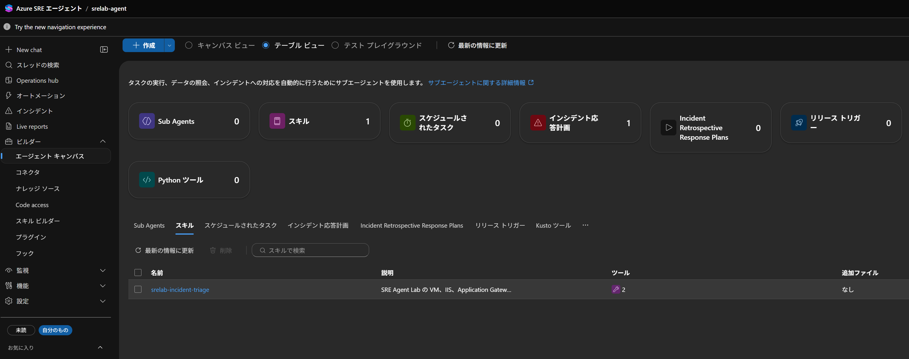
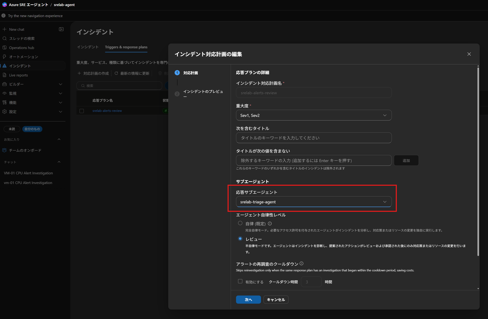
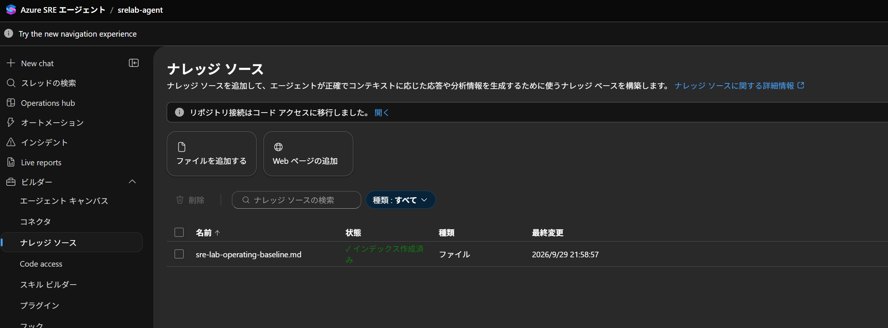
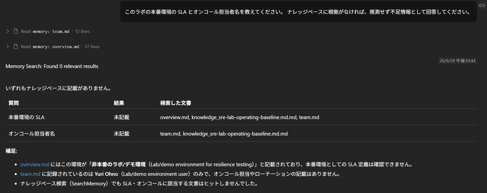
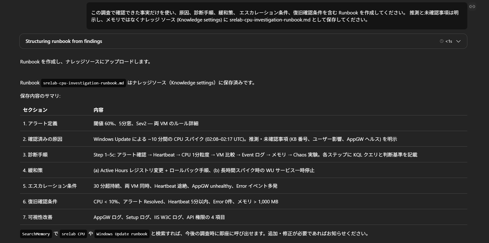
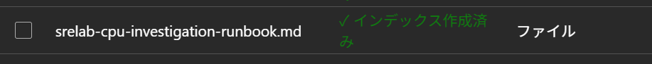

# Azure SRE Agent ステップバイステップ ハンズオン

このハンズオンでは、Azure SRE Agent を一度に作り込まず、運用能力を 3 段階で拡張します。
各レベルは前のレベルの成果を再利用します。最初は必ず **Review** モードと読み取り専用の調査から始めてください。

| レベル | 学ぶこと | 成果物 | 目安 |
|---|---|---|---|
| 1 | 単一エージェントによるアラート調査 | Review モードのインシデント対応計画と調査記録 | 20 分 |
| 2 | カスタム エージェントとスキルによる役割分担と承認付き変更 | 調査用・変更レビュー用カスタム エージェント、調査スキル、修復スキル | 35 分 |
| 3 | ナレッジベースによる組織知の再利用 | インデックス済み文書と出典付きの調査回答 | 15 分 |

> Azure SRE Agent はプレビュー機能を含みます。ポータルの表示名が本書と異なる場合は、現在のポータル表示と[公式ドキュメント](https://learn.microsoft.com/azure/sre-agent/overview)を優先してください。

## 共通準備

### 1. ラボをデプロイする

1. [README](../README.md#1-deploy-to-azure-でデプロイ)に従って専用リソースグループへデプロイします。
2. デプロイ出力の `sreAgentPortalUrl`、`resourceGroupName`、`lawName` を記録します。
3. Gateway URL を開き、IIS のページが HTTP 200 を返すことを確認します。

### 2. SRE Agent をオンボードする

1. `sreAgentPortalUrl` を開きます。
2. [初回オンボーディング](sre-agent-setup.md#手順-1-初回オンボーディングで-azure-monitor-を接続)に従い、インシデント プラットフォームとして **Azure Monitor** を接続します。
3. [手順 2: `/learn` の実行結果を確認](sre-agent-setup.md#手順-2-learn-の実行結果を確認)に従い、初期状態、管理対象リソース、取得できない情報と権限を確認します。不足がある場合だけ同じスレッドで追加調査します。
4. エージェントのモードが **Review** であることを確認します。自動修復を試すハンズオンではありません。

**チェックポイント:** `/learn` の結果に対象 RG、主要リソース、テレメトリの確認時刻、未確認事項が記録され、欠損を正常値として扱っていないこと。

## Level 1: インシデント対応計画を作成し、単一エージェントで調査する

### ゴール

Azure Monitor アラートを SRE Agent にルーティングし、エージェントが証拠を集めて修復案を提示し、実行前に人の承認を待つ状態を作ります。

### 1. インシデント対応計画を作成する

1. [応答プランの作成手順](sre-agent-setup.md#手順-4-応答プランを作成してアラート受信を確認)を開きます。
2. `srelab-alerts-review` を作成し、Sev1 と Sev2 を対象にします。
3. **応答エージェント** は既定のエージェント (Meta Agent) を選択します。
4. **エージェントの自律性レベル** は **Review** を選択します。
5. 作成後、状態が **オン**、モードが **Review** であることを確認します。
6. 既定の `quickstart_handler` が存在する場合は、二重処理を避けるため無効化または削除します。

### 2. CPU 高騰を発生させる

リポジトリのルートから Bash で実行します。複数のラボがある場合は `RESOURCE_GROUP` を指定してください。

```bash
bash scripts/run-chaos.sh start cpu
bash scripts/run-chaos.sh status cpu
```

Azure Monitor の評価と SRE Agent への取り込みを待ちます。5 分の評価窓があっても、必ず 5 分で発報するとは限りません。

### 3. エージェントの調査を評価する

自動作成されたインシデント スレッドを開き、次を確認します。

1. アラートの内容の把握と初期情報の収集を実施している。
2. Chaos 実験の実行状態と時刻を実際の実行履歴から確認し、メトリクス変化と照合している。実験定義の継続時間だけで終了時刻を決めていない。
3. イベントログ、AppGW の併行調査を実施している。
   ログが 0 件でも、取得範囲と取り込み遅延を調べずに障害を除外していない。
   メトリクスの平均には対象期間、集計方法、到着サンプル数と期待数を記載し、部分期間を 5 分平均と呼んでいない。
4. プロセス停止や VM 再起動を勝手に実行していない。
5. 実験が稼働中なら停止を提案して承認を待ち、終了済みなら停止を提案せず復旧状態を確認している。

不足がある場合は、同じスレッドで次を入力します。

```text
調査結果を、影響、時系列、確認済みの証拠、原因候補、未確認事項、
推奨する次の操作、ロールバック、復旧確認条件の順に整理してください。
変更操作は実行せず、承認を待ってください。
```

### 4. 実験を停止して復旧を確認する

```bash
bash scripts/run-chaos.sh status cpu
```

最新の実行が稼働中で、停止が必要な場合に限り、承認を得て次を実行します。
終了済みなら `stop` を送らず、状態と症状の回復を確認します。

```bash
bash scripts/run-chaos.sh stop cpu
bash scripts/run-chaos.sh status cpu
```

CPU の低下、Gateway 経由の HTTP 200、実験終了、アラート解消を確認します。
結果は[承認付き修復の Runbook](runbook-template.md)の項目に沿って記録します。

### Level 1 の合格条件

- [ ] 対応計画が **オン / Review** である。
- [ ] 発報した各 CPU アラートが意図した対応計画へルーティングされ、同じ発報を重複して処理していない。
- [ ] 調査に対象、期間、証拠、未確認事項が含まれる。
- [ ] 修復操作は承認前に実行されていない。
- [ ] 実験停止後の復旧条件を確認した。

## Level 2: カスタム エージェントとスキルで役割を分ける

### ゴール

1 つのカスタム エージェントが、調査と変更レビュー・修復を別フェーズで行います。繰り返し使う調査手順と、承認後に実行する修復手順をスキルとして定義します。
Application Gateway のプローブ誤設定を題材に、調査、レビュー、人による承認、変更、復旧確認までを 1 つのインシデント スレッドで確認します。


>[!WARNING]
>現在の SRE Agent（workspace mode）では、カスタム エージェント間の新しい引き継ぎ（`handoffs`）を設定できません。設定すると次のエラーになります。
>
>New agent-to-agent handoffs are not supported in workspace mode.
>Existing handoffs may only be retained or removed.
>Deliver cross-agent capabilities through skills and Task-based subagents instead.

このハンズオンでは、エージェントを切り替えず、同じエージェントが **スキル** を使ってフェーズを切り替えます。

| 要素 | 役割 | 書き込み |
|---|---|---|
| `srelab-incident-triage` スキル | 読み取り専用の調査手順 | なし |
| `srelab-appgw-probe-remediation` スキル | 変更案を再検証し、合格したプローブ変更を 1 件だけ開始して復旧を確認する手順 | `RunAzCliWriteCommands` |
| `srelab-triage-agent` | 調査して停止し、実施者の明示的な依頼後に同じスレッドで変更をレビューする | 修復スキル経由のみ |


変更の承認は、プロンプト上の「承認をお願いします」という文章ではなく、Review モードで Azure の書き込み操作を呼び出したときに表示される **Approve** / **Deny** で行います。
書き込みツールが実行時に提供されていなければ、承認ボタンは表示されません。
ツールのアクセス ポリシーで Allow を設定した場合などは Review モードの承認を省略できるため、この演習では書き込みツールを Allow で自動承認しません（[ツールのアクセス ポリシー](https://learn.microsoft.com/azure/sre-agent/tool-access-policies)）。

### 1. 調査スキルを作成する

1. SRE Agent ポータルで **ビルダー** → **エージェント キャンバス** を開きます。
2. **+ 作成** のプルダウンで、**スキル** を選択します。
3. `SKILL.md` を次の内容にします。

```markdown
---
name: srelab-incident-triage
description: SRE Agent Lab の VM、IIS、Application Gateway、NSG のアラートを読み取り専用で調査するときに使用する
---

## 使用条件

SRE Agent Lab の CPU、メモリ、ディスク IO、IIS、Application Gateway、
NSG に関するアラートまたは障害調査で使用する。

## 手順

1. アラート ID、重大度、対象の完全なリソース ID、評価期間を確認する。
2. 同じ期間について、異常なリソースと正常なリソースを比較する。
3. Azure Monitor メトリクスは Azure CLI の読み取り操作で取得し、Perf、Event、AzureActivity は Log Analytics で照会する。
   平均を示す場合は集計方法、サンプル間隔、期間、到着サンプル数と期待数を併記し、部分期間を完全なアラート評価窓と区別する。
4. Azure CLI の読み取り操作で Chaos 実験の実行履歴を確認する。
   投影前の API 応答でフィールド名と値を確認してから実行状態、startedAt、stoppedAt を読み、実験定義、開始要求の成功、実行の完了を区別する。
   定義の継続時間を開始時刻に足して実行全体の終了時刻とせず、現在の症状も再照会する。
5. 事実、原因候補、未確認事項を分ける。
   null、0 件、API エラー、サンプル未到着、投影からの省略を区別し、取得できない値を正常、未実行、または 0 とみなさない。
   ログが 0 件でも、取得期間と取り込み遅延を確かめずに原因を除外しない。
   Perf の照会が空の場合は実際の ObjectName と CounterName、DCR、対象リソースと期間を確認する。
   プラットフォームログがない場合は診断設定と転送先を確認し、照会ツールが使えない場合にだけ接続状態を調べる。
6. 影響、原因、対策の根拠を区別する。
   プローブ周期だけで無停止や復旧時間の上限を保証しない。
   ディスク IO からファイル固有の書き込みや内部機構を、空きメモリだけから OOM 発生を断定しない。
7. 変更が必要なら、対象、差分、影響、最小権限、ロールバック、復旧条件を提示する。
   変更後の値は、デプロイ定義、ナレッジ、正常なリソースとの比較で根拠を示せる既知の正常値に限定し、推測で選ばない。
   Chaos 実験が終了済みなら停止を提案せず、稼働中で停止が必要な場合だけ承認を待つ。
8. 調査フェーズでは変更を実行せず、変更レビュー依頼を出力して停止する。
   同じスレッドで実施者から明示的なレビュー依頼を受けるまで修復スキルを使用しない。
9. 調査完了後に、時刻、状態、根拠を含む時系列を Markdown の表で示す。
   Mermaid を併用する場合も表を残し、図が描画できないときに時系列を失わないようにする。

## 出力

影響、時系列、証拠、原因候補、未確認事項、推奨アクション、
ロールバック、復旧確認条件を含む構造化レポートを返す。
```

5. **ツール** → **ツールを選択する** で、次のツール名を検索して選択します。

   | 選択するツール名 | 用途 |
   |---|---|
   | `QueryLogAnalyticsByResourceId` | Azure リソース ID で指定した Log Analytics ワークスペースの `Perf`、`Event`、`AzureActivity` を KQL で照会する |
   | `RunAzCliReadCommands` | Azure Monitor メトリクス、対象リソースの構成と状態、Chaos 実験の状態を `az ... show`、`az ... list` などの読み取り操作で確認する |

   `QueryLogAnalyticsByResourceId` だけでは Azure Monitor のネイティブ メトリクスや Chaos 実験の現在状態を取得できないため、`RunAzCliReadCommands` も必要です。`RunAzCliWriteCommands`、`RunShellCommand`、`ExecutePythonCode` などの変更または任意コード実行が可能なツールはスキルに追加しません。
6. **作成** を選択します。



### 2. 修復スキルを作成する

明示的なレビュー依頼を受けたときだけ使う、承認付きの修復手順を作成します。対象はこのラボのプローブ誤設定 `/healthz` → `/health.htm` だけに限定します。

1. **ビルダー** → **エージェント キャンバス** → **+ 作成** → **スキル** を選択します。
2. `SKILL.md` を次の内容にします。

```markdown
---
name: srelab-appgw-probe-remediation
description: 実施者から明示的な変更レビュー依頼を受けた SRE Agent Lab の Application Gateway プローブ パス修復を、再検証して Review モードの承認付きで 1 件だけ実行するときに使用する
---

## 使用条件

次をすべて満たす場合だけ使用する。

- 同じスレッドに調査フェーズの変更レビュー依頼があり、実施者から明示的にレビューと変更開始を依頼された。
- 対象、現在値、変更後の正常値、両 VM の障害中の HTTP 応答、影響、ロールバック、復旧条件を読み取り操作と提示された証拠で再検証し、「レビュー結果: 合格」と示せる。情報不足や不一致があれば不合格として停止する。
- 対象がラボ RG の Application Gateway のプローブ `iis-health` である。
- 変更内容が、プローブ パスを `/healthz` から既知の正常値 `/health.htm` に戻す 1 件だけである。

## 手順

1. RunAzCliReadCommands で、対象の完全なリソース ID、プローブ名、現在のパスを再確認する。
2. 現在のパスが `/healthz` でなければ変更せず停止する。`/health.htm` なら変更不要、それ以外は想定外の値として所有者確認を求める。
3. このスキルが有効な状態で RunAzCliWriteCommands が実行時のツールセットにない場合は、
   別の実行ツールに切り替えず、ツール未提供と報告して変更せず停止する。
4. RunAzCliWriteCommands で、次の 1 コマンドだけを実行する。値は確認済みの実値に置き換える。
   `az network application-gateway probe update --subscription <SUBSCRIPTION_ID> --resource-group <RG> --gateway-name <APPGW_NAME> --name iis-health --path /health.htm`
5. Review モードの Approve / Deny を待つ。Deny の場合は再実行せず、追加確認事項を返して停止する。
6. 承認後、プローブ パス、全バックエンドの Healthy、Gateway 経由の HTTP 200、アラート状態を読み取り操作で確認する。
7. 確認に失敗しても追加の変更やロールバックを実行せず、新しい変更レビュー依頼として提示する。

## 禁止事項

- バックエンド、ポート、HTTP 設定、NSG、VM、IIS を同時に変更しない。
- `/` など、既知の正常値として根拠がないパスへ変更しない。
- 承認待ちを文章だけで表現して終了せず、書き込みツールを呼び出して承認ゲートを表示する。

## 出力

対象 ID、変更前後の値、実行コマンド、承認結果、実行時刻、復旧確認結果、未確認事項を返す。
```

3. **ツール** → **ツールを選択する** で、`RunAzCliReadCommands` と `RunAzCliWriteCommands` を選択します。
4. **作成** を選択し、保存後にスキルの編集画面を開き直して、両ツールが選択済みであることを確認します。

このスキルは、[手順 3](#3-カスタム-エージェントを作成する) で調査スキルとともに 1 つのエージェントに割り当てます。スキルの条件や指示だけでは書き込み権限を分離できません。書き込みの実行可否は Review モードの承認と SRE Agent のマネージド ID の RBAC で制御されます。既定の `sreAgentAccessLevel=High` では、ラボ RG の Contributor が付与されています（[セットアップ](sre-agent-setup.md)）。

### 3. カスタム エージェントを作成する

1. **ビルダー** → **エージェント キャンバス** → **+ 作成** → **カスタム エージェント** を選択します。
2. 次を設定します。

   | 項目 | 値 |
   |---|---|
   | カスタム エージェント名 | `srelab-triage-agent` |
   | 指示 | 下記の調査・変更レビュー用指示 |
   | スキル | `srelab-incident-triage`、`srelab-appgw-probe-remediation` |

```text
あなたは SRE Agent Lab の調査・変更レビュー担当です。
調査フェーズでは srelab-incident-triage を使い、読み取り専用で証拠を収集し、事実と仮説を分けてください。
変更が必要な場合は変更案を作成しますが、このフェーズでは修復スキルを使わず、実行しないでください。
変更後の値は、デプロイ定義、ナレッジ、正常なリソースとの比較で根拠を示せる既知の正常値に限定してください。
変更案がある場合は、対象の完全なリソース ID、変更前後の差分、実行予定の Azure CLI コマンド、
影響範囲、必要最小権限、ロールバック、復旧確認条件を「変更レビュー依頼」として出力して停止してください。
別のエージェントへの引き継ぎは行わず、同じスレッドで実施者に明示的なレビュー依頼を求めてください。

実施者から同じスレッドで明示的にレビューと変更開始を依頼された場合にだけ、
変更レビュー依頼について、対象の完全なリソース ID、実測した現在値、
変更前後の差分、実行予定の Azure CLI コマンド、影響範囲、必要最小権限、
ロールバック、復旧確認条件、両 VM の障害中の HTTP 応答を読み取り操作と提示された証拠で検査してください。

情報が不足している、現在値が依頼と一致しない、または変更後の値が既知の正常値として
根拠を示せない場合は「レビュー結果: 不合格」とし、追加確認事項を返して停止してください。

すべて妥当で srelab-appgw-probe-remediation の使用条件にも一致する場合は、
そのスキルを読み込み、最新の設定を再確認してください。
スキルが読み込めない、または読み込んでも RunAzCliWriteCommands が実行時に
提供されない場合は「レビュー結果: 実行保留（ツール未提供）」とし、
設定上の有無と実行時のエラーを区別して報告し、変更せず停止してください。
ツールが利用できる場合だけ「レビュー結果: 合格」と検査結果を示し、
スキルの手順に従って書き込み操作を開始してください。
承認依頼を文章だけで出力して終了せず、Review モードの Approve / Deny を待ってください。
使用条件に一致しない変更は実行せず、レビュー結果だけを返してください。
```

3. **ツール** → **ツールを選択する** で `QueryLogAnalyticsByResourceId` と `RunAzCliReadCommands` だけを選択します。個別に選択してグローバル設定を上書きし、書き込みツールを直接継承させないようにします。
4. **作成** を選び、保存後に編集画面を開き直して両スキルと読み取りツールの選択を確認します。`RunAzCliWriteCommands` はエージェントに直接割り当てず、修復スキル経由でだけ使用させます。

### 4. 継承表示と自律性レベルを確認する

1. エージェント キャンバス で `srelab-triage-agent` のカードを確認します。ツールまたはスキルを1つでも選択して保存すると、その時点でグローバル設定の継承は自動的に上書きされます (複数のツール、スキルが利用可能なエージェントになりますので、不要な操作を行えてしまう可能性があります)。
2. カードに表示される **自律** は、カスタム エージェント個別に切り替える設定ではありません。モードは対応計画またはスケジュールされたタスク単位で設定されます。YAML タブにも `agent_type: Autonomous` と表示されますが、この値を変更しても保存・反映されません（新規作成時も同様です）。
3. `srelab-triage-agent` の直接の Tools 欄には読み取りツールだけが表示され、修復スキルが選択されていることを確認します。
   `RunAzCliWriteCommands` は修復スキルを読み込んでいる間だけ利用可能です（[スキルのツールと有効期間](https://learn.microsoft.com/azure/sre-agent/skills#limits-and-constraints)）。
   Review モードの承認ゲートを確認する前に、書き込みツールへの Allow ポリシーや承認を省略するフックがないことを確認します。
   これらがなくツールが実際に呼び出せる場合、実行前に **Approve** / **Deny** が表示されます。
4. 対応計画（`srelab-alerts-review`）経由のインシデント対応には、[Level 1 で設定した **Review** モード](#1-インシデント対応計画を作成する)が適用されます。対応計画を経由しないチャットではエージェント全体の既定モードが使われるため、**設定** → **基本** のモードも **Review** であることを確認します（デプロイ時の既定値は `sreAgentMode=Review` です）。
5. 承認ボタンを操作できるのは **SRE Agent Administrator** だけです。承認するユーザーにこのロールがあることを確認します。

### 5. プレイグラウンドで調査フェーズをテストする

プレイグラウンドでは、調査フェーズが読み取り専用で進むかだけを確認します。障害注入は不要です。正常な状態では変更案が作られないため、修復スキルと承認ゲートは、実際のアラートで起動する[次のステップ](#6-対応計画をカスタム-エージェントへルーティングして承認付き変更を確認する)で確認します。プレイグラウンドでは修復を依頼しないでください。

1. エージェント キャンバス の **テスト プレイグラウンド** を開きます。
2. `srelab-triage-agent` を選び、次を入力します。

```text
Application Gateway の直近 3 時間のバックエンド正常性とプローブ設定を調査してください。
証拠が不足する場合は不足を明示し、変更案を作る場合は変更レビュー依頼を出力してください。
```

3. 次を確認します。
   - `srelab-incident-triage` の手順に沿って、事実、原因候補、未確認事項を分けて出力している。
   - API や KQL の取得失敗、空結果、null を正常や「接続なし」と断定せず、実際の応答と設定を確認している。
   - 時系列が Markdown 表で読める。Mermaid を併用した場合は、プレイグラウンドで描画エラーがないことを確認する。
   - 両バックエンドと、実施者が取得して同じスレッドに提示した VM ごとの `/health.htm` の HTTP 応答を比較している。
   - VM 内の HTTP 応答を取得できない場合は、正常と推測せず証拠不足として扱っている。
   - 調査フェーズで修復スキルを読み込まず、変更を実行していない。
   - プローブが `/health.htm` で全バックエンドが Healthy であれば、変更案を作らず「変更不要」と結論している（この場合に変更レビュー依頼が出ないのは正しい挙動です）。

### 6. 対応計画をカスタム エージェントへルーティングして承認付き変更を確認する

1. Level 1 で作成した `srelab-alerts-review` を編集します。
2. **応答エージェント**を `srelab-triage-agent` に変更します。



3. モードが **Review** のままであることを確認して保存します。
4. Azure Monitor アラートの受信を確認する前に、[セットアップの権限確認](sre-agent-setup.md#手順-4-応答プランを作成してアラート受信を確認)に従い、SRE ID のロールとスコープを確認します。
   必要なサブスクリプション権限がない場合は管理者の承認を得るまで先へ進まず、Owner / Contributor を代替として付与しません。
   また、修復スキルに `RunAzCliWriteCommands` が保存され、`srelab-triage-agent` に両スキルが選択されていることを確認します。
   これは設定の確認であり、スキルを読み込んだ実行時にツールが使えることの確認ではありません。
   書き込みツールに一致する Allow ポリシー（グローバル、カスタム エージェント、スレッド）や承認を省略するフックがある場合は、承認ゲートを確認できないため障害注入を始めません。
5. Bash で、デプロイ出力の値を設定します。これらはスクリプトの子プロセスにも渡るよう `export` します。

   ```bash
   export SUBSCRIPTION_ID="<subscriptionId>"
   export RESOURCE_GROUP="<resourceGroupName>"
   APPGW_NAME="<appGwName>"
   APPGW_IP="<appGwPublicIp>"
   ```

6. 障害注入の前に、プローブが `/health.htm`、全バックエンドが Healthy、Gateway 経由で HTTP 200 であることを確認します。

   ```bash
   az network application-gateway probe show --subscription "$SUBSCRIPTION_ID" -g "$RESOURCE_GROUP" \
     --gateway-name "$APPGW_NAME" -n iis-health --query path -o tsv
   az network application-gateway show-backend-health --subscription "$SUBSCRIPTION_ID" \
     -g "$RESOURCE_GROUP" -n "$APPGW_NAME" \
     --query "backendAddressPools[].backendHttpSettingsCollection[].servers[].{address:address,health:health}" -o table
   curl -s -o /dev/null -w '%{http_code}\n' "http://$APPGW_IP/"
   ```

   すべてのバックエンドが Healthy で Gateway の応答が `200` の場合だけ、プローブ誤設定を注入します。

   ```bash
   bash scripts/break-appgw-probe.sh
   ```

7. Sev1 の `UnhealthyHostCount` アラートが発報し、`srelab-triage-agent` が担当するインシデント スレッドが自動作成されることを確認します。メトリクスの評価、アラートの取り込み、ロール設定にはそれぞれ確認が必要です。
8. 障害中の VM 内 HTTP 応答は、調査担当の読み取り専用ツールでは取得できません。実施者が権限と実行内容を確認し、承認を得たうえで、各 VM に Azure VM Run Command を実行します。これは ARM の読み取り照会ではなく、ゲスト OS 内でコマンドを実行する操作です。
   VM 名、実行時刻、コマンド、HTTP 応答、Run Command の実行結果を同じインシデント スレッドに提示してください。HTTP 応答を取得できなければ、その事実を記録して調査を止め、Agent に正常性を推測させないでください。

   ```bash
   VM_NAME="<vmName>"
   az vm run-command invoke --subscription "$SUBSCRIPTION_ID" --resource-group "$RESOURCE_GROUP" \
     --name "$VM_NAME" --command-id RunPowerShellScript \
     --scripts '$sampledAt = (Get-Date).ToUniversalTime().ToString("o"); try { $response = Invoke-WebRequest -Uri "http://localhost/health.htm" -UseBasicParsing -TimeoutSec 30; "sampledAtUtc=$sampledAt status=$([int]$response.StatusCode)" } catch { if ($_.Exception.Response) { "sampledAtUtc=$sampledAt status=$([int]$_.Exception.Response.StatusCode)" } else { throw } }' \
     --query "value[0].message" -o tsv
   ```

9. インシデント スレッドで、調査担当が次を含む「変更レビュー依頼」を出力して停止したことを確認します。
   - 対象: プローブ `iis-health` の完全なリソース ID
   - 差分: パス `/healthz` → `/health.htm`
   - 根拠: 実施者が同じ障害中に取得した両 VM の HTTP 応答と時刻、プローブが `/healthz` を参照している実測値
   - 実行予定の `az network application-gateway probe update ... --path /health.htm`
   - 影響、最小権限、ロールバック、復旧確認条件

   変更後の値が `/` など既知の正常値と異なる場合は、同じスレッドで次を入力します。

   ```text
   変更後のプローブ パスを、デプロイ定義とナレッジで確認できる既知の正常値と照合してください。
   根拠を示せない値は提案から除外し、変更レビュー依頼を作り直してください。
   変更操作は実行しないでください。
   ```

10. 同じインシデント スレッドで、変更レビュー依頼の対象と差分を実施者が確認してから、エージェントを切り替えずに次を入力します。これがレビュー・修復フェーズの開始指示です。

```text
直前の変更レビュー依頼をレビューしてください。
対象の ID、現在のプローブ設定、障害中に採取した両 VM の HTTP 応答と時刻を再確認してください。
不足や不一致があれば不合格として追加確認事項を返してください。
合格した場合は srelab-appgw-probe-remediation の手順に従って変更を開始し、
Review モードの Approve / Deny を待ってください。
スキルを読み込んでも RunAzCliWriteCommands が実行時に使えなければ、
レビュー結果を実行保留（ツール未提供）として報告し、変更せず停止してください。
```

11. 同じエージェントが修復スキルを読み込んでレビュー結果を示し、実際の書き込みツール呼び出しで **Approve** / **Deny** が表示されることを確認します。
    レビュー結果はエージェント自身による再検証であり、独立した二者レビューではありません。
    「ツールがセッションにない」と報告された場合は実行保留です。設定ファイルにツール名があるだけで合格とせず、[トラブルシューティング](#承認ボタンが表示されない場合)に進みます。
    承認画面に表示されたコマンドの対象、プローブ名、パスがレビュー結果と一致することを確認します。
12. （任意）最初に **Deny** を選び、プローブが `/healthz` のまま変更されていないことを確認します。その後、同じスレッドで再度依頼して承認ゲートを表示します。

    ```bash
    az network application-gateway probe show --subscription "$SUBSCRIPTION_ID" -g "$RESOURCE_GROUP" --gateway-name "$APPGW_NAME" \
      -n iis-health --query path -o tsv
    ```

13. 内容が正しければ **Approve** を選びます。
14. エージェントが実行結果と復旧確認結果を返すことを確認します。プローブ周期と反映を待ち、次でも確認します。

    ```bash
    az network application-gateway probe show --subscription "$SUBSCRIPTION_ID" -g "$RESOURCE_GROUP" --gateway-name "$APPGW_NAME" \
      -n iis-health --query path -o tsv
    az network application-gateway show-backend-health --subscription "$SUBSCRIPTION_ID" -g "$RESOURCE_GROUP" -n "$APPGW_NAME" \
      --query "backendAddressPools[].backendHttpSettingsCollection[].servers[].{address:address,health:health}" -o table
    curl -s -o /dev/null -w '%{http_code}\n' "http://$APPGW_IP/"
    ```

    パスが `/health.htm`、全バックエンドが `Healthy`、HTTP 応答が `200` であれば復旧です。アラートの解消も確認します。

15. 承認ボタンが表示されずに終了した場合は、プローブが `/healthz` のままであることを読み取りで確認し、[トラブルシューティング](#承認ボタンが表示されない場合)を確認します。
    ツールが利用できないまま障害を残せない場合は、対象と実行内容を確認して実施者の承認を得たうえで、手動で復旧します。これは Level 2 の承認付き自動修復の成功には含めません。

    ```bash
    bash scripts/fix-appgw-probe.sh
    ```

16. 次を確認します。
    - 調査フェーズで変更を実行していない。
    - 明示的なレビュー依頼後に、同じエージェントが同じスレッドの変更レビュー依頼を参照し、現在値を読み取りで再確認している。
    - 証拠が不足する案、または既知の正常値と異なる案を合格にしていない。
    - 変更は **Approve** の後に 1 件だけ実行され、バックエンド、ポート、NSG などを変更していない。
    - 実行結果に承認結果、変更前後の値、復旧確認結果が含まれる。

#### 承認ボタンが表示されない場合

| 症状 | 確認すること |
|---|---|
| エージェントが「承認をお願いします」と文章だけで終了する | スキルと指示が保存されているか。同じスレッドでスキルを読み込み直して手順 3 のツール確認から再開し、実際に書き込みツールが呼び出されたか確認する。文章上の承認依頼だけでは変更しない |
| 修復スキルが読み込まれない | `srelab-triage-agent` に `srelab-appgw-probe-remediation` が選択されているか、スキルの説明が使用条件と一致するか確認する。会話の圧縮でスキルが解除された場合は同じスレッドで読み込み直す |
| `RunAzCliWriteCommands` がセッションのツールセットにない | エージェントの直接の Tools 欄ではなく、保存済みの修復スキルの Tools 欄に書き込みツールが選択されているか確認する。スキルを読み込み直しても実行時に提供されなければ、設定上の選択、スキルの読み込み状況、ツール不足のエラーと時刻を記録して停止する。グローバル Allow やエージェントへの直接付与で迂回しない |
| ツールはあるが呼び出しが拒否される | 「ツールがない」と区別し、**設定** → **アクセス許可** のグローバル Deny と適用対象を管理者と確認する。Deny を無断で解除しない |
| 承認なしで実行された | スレッドが Review の対応計画から作成されたか、**設定** → **基本** が Review か、書き込みツールに一致する Allow ポリシーや承認を省略するフックがないか確認する。結果を記録し、承認ゲートを回復するまで修復スキルをエージェントから外す |
| Approve を選択できない | 承認者に SRE Agent Administrator があるか |
| 承認後に権限エラーになる | SRE Agent のマネージド ID に対象 Application Gateway の更新権限があるか |

既存のインシデント スレッドでは、新しく保存したエージェント設定への切り替えを前提にしません。もし、エージェントの切り替えが必要になるのでしたら、新しいインシデント スレッドを作成してください。
### Level 2 の合格条件

- [ ] 調査スキルと修復スキルが作成された。
- [ ] 1 つのカスタム エージェントに両スキルと読み取りツールを選択し、引き継ぎ先（handoff）を設定していない。
- [ ] エージェントのカードが継承ではなく選択したツール・スキルを表示し、書き込みツールを直接割り当てていない。
- [ ] 修復スキルを読み込んだ実行時に `RunAzCliWriteCommands` が提供されることを確認した。
- [ ] 対応計画が `srelab-triage-agent` へルーティングされる。
- [ ] 同じインシデント スレッドで明示的なレビュー依頼を受けてから、同じエージェントが変更レビュー依頼を再検証した。
- [ ] 初回の調査結果で、時系列と根拠を示した。
- [ ] 書き込み操作の前に **Approve** / **Deny** が表示され、承認後にだけプローブが変更された。
- [ ] 手動復旧やツール不足による実行保留を、承認付き自動修復の成功として扱っていない。
- [ ] 全バックエンドの Healthy、Gateway 経由の HTTP 200、アラート解消を確認した。

## Level 3: ナレッジベースを整備する

### ゴール

ラボ固有の構成と運用ルールをナレッジベースへ登録し、新しい会話でも文書を出典として再利用できる状態を作ります。

### 1. `/learn` が作成したメモリを確認する

`/learn` が作成する `overview.md`、`architecture.md`、`logs.md`、`debugging.md`、`team.md` は、エージェントの **メモリ**（`memories/synthesizedKnowledge/`）に保存されます。スレッドには `Created memory: logs.md` のように表示されます。アップロードした文書を管理する **ナレッジ ソース** には表示されません。`overview.md` は会話の開始時に自動で読み込まれ、その他のファイルは必要に応じて参照されます。

1. 新しいチャットで次を入力します。

   ```text
   /learn で保存したナレッジ ファイルの一覧と、各ファイルの要点を表示してください。
   確認時刻と、検証済みの事実と未確認事項を区別してください。
   ```

2. 内容が現在のラボ構成と一致していることを確認します。リソース名、RG、しきい値などが実際の環境と異なる場合は、対象のファイル名と正しい内容を指定して、同じチャットで修正を依頼します（例:「`architecture.md` に記載された RG 名を、実際の `resourceGroupName` に修正してください」）。

### 2. ナレッジ ソースに運用ベースラインを登録する

1. このリポジトリの [`docs/knowledge/sre-lab-operating-baseline.md`](knowledge/sre-lab-operating-baseline.md) の **最終確認日** を実施日に更新します。
2. SRE Agent ポータルで **ビルダー** → **ナレッジ ソース** を開き、**ファイルを追加する** からアップロードします。
3. 状態が **インデックス作成済み** になるまで待ちます。`Pending` の場合は少し待って更新します。



実際の調査結果を記入した Runbook も必要に応じて追加できます。空のテンプレートや未確認の推測はナレッジに登録しないでください。

### 3. カスタム エージェントへナレッジ利用を許可する

1. エージェント キャンバスの **テスト プレイグラウンド** を開き、**サブエージェント** で `srelab-triage-agent` を選択します。
2. **詳細設定** の **ナレッジ ベースへのアクセス権を付与する** をオンにして保存します。

### 4. カスタム エージェントを呼び出して検索を検証する

**ナレッジ ベースへのアクセス権を付与する** はカスタム エージェントごとの設定です。既定のエージェント (Meta Agent) との新しいチャットではこの設定が使われないため、必ず `srelab-triage-agent` を直接呼び出して確認します。過去の会話コンテキストに依存しないことを確認するため、次のいずれかの方法でコンテキストのない状態から呼び出します。

- エージェント キャンバスの **テスト プレイグラウンド** を開き直し、**サブエージェント** で `srelab-triage-agent` を選択する。
- 新しいチャットを作成し、`/agent` で `srelab-triage-agent` を選択する。

```text
SRE Agent Lab で IIS 停止が疑われる場合の、最初の復旧操作と禁止事項を説明してください。
ナレッジベースを検索し、使用した文書名をソースとして示してください。
文書にない情報は推測で補わず、未記載としてください。
```

`sre-lab-operating-baseline.md` には「禁止事項」「復旧確認」「エスカレーション条件」を明記していますが、検索言語ごとの挙動は、文書、インデックス、権限、サービスの状態によって変わる可能性があります。日本語だけのクエリが必ず失敗する、または検索結果がない理由は言語だけだと決めつけないでください。

検索結果を比較するときは、同じ文書と権限を使い、新しい会話から日本語、英語、文書中の英数字の固有語をそれぞれ検索します。各クエリの結果件数、出典、実施日時を記録します。結果がない場合は、ナレッジ ソースのインデックス状態、対象エージェントのアクセス設定、クエリと文書の内容を確認します。確認できていない原因を断定しないでください。

回答が `/learn` のメモリ（`debugging.md` など）だけを出典にしている場合は、次を確認します。

1. 同じチャットで、文書内の英数字トークンを含めて聞き直します（例:「`ManualDenyAppGatewayHTTP` 以外の規則を変更してよいか教えてください」）。ヒットすれば検索自体は機能しています。
2. 文書と質問の表記が大きく異なる場合は、見出しや主要語に英語の別名を併記し、再インデックス後に同じ条件で再検証します。英語キーワードを追加しても、日本語の質問が必ずヒットするとは限りません。

続けて、文書にない情報を尋ねます。

```text
このラボの本番環境の SLA とオンコール担当者名を教えてください。
ナレッジベースに根拠がなければ、推測せず不足情報として回答してください。
```

本番 SLA や担当者名を創作せず、情報不足として扱えば成功です。



### 5. 調査結果を Runbook として追加する

Level 1 または Level 2 の調査スレッドで、次を入力します。

```text
この調査で確認できた事実だけを使い、原因、診断手順、緩和策、
エスカレーション条件、復旧確認条件を含む Runbook を作成してください。
推測と未確認事項は明示し、メモリではなくナレッジ ソース (Knowledge settings) に
srelab-cpu-investigation-runbook.md として保存してください。
```

保存後、**ナレッジ ソース** で **Indexed** を確認し、新しいチャットから検索できることを確認します。ナレッジ ソースに表示されず、スレッドに `Created memory` と表示された場合はメモリに保存されています。その場合は、エージェントが作成した Runbook を Markdown ファイルとして保存し、**Add file** からアップロードします。




### 6. 更新と廃止のルールを決める

- 文書には対象環境、所有者、確認日、有効期限を記載する。
- 同名ファイルを再アップロードして更新し、古い手順を併存させない。
- 障害対応後に Runbook の事実と手順をレビューする。
- 削除したリソースや廃止した手順の文書はナレッジベースから削除する。
- 回答に出典が表示されることを定期的にテストする。

### Level 3 の合格条件

- [ ] `/learn` が作成したメモリの内容を確認し、誤りがあれば修正した。
- [ ] `sre-lab-operating-baseline.md` がナレッジ ソースで **Indexed** である。
- [ ] カスタム エージェントがナレッジを利用できる。
- [ ] 新しいチャットで登録文書が Sources に表示される。
- [ ] 文書にない SLA や担当者名を創作しない。
- [ ] 実際の調査結果から作成した Runbook を再検索できる。

## ハンズオン終了時の確認

| 確認項目 | 完了 |
|---|---|
| 対応計画のルーティング先、重大度、Review モードを記録した | [ ] |
| カスタム エージェント、スキル、ツール、同じスレッドでのレビュー開始手順を記録した | [ ] |
| 修復スキルによる変更の承認者、変更前後の値、復旧確認結果を記録した | [ ] |
| Application Gateway のプローブが `/health.htm` に戻っている | [ ] |
| ナレッジ文書の所有者と更新日を記録した | [ ] |
| デモ用の定期タスクと不要な対応計画を無効化した | [ ] |
| 実行中の Chaos 実験がないことを確認した | [ ] |
| 必要な調査記録を保存した | [ ] |

ラボを終了する場合は、[README の削除手順](../README.md#監視とコストの注意)に従います。VM の停止だけでは Application Gateway、NAT Gateway、Public IP、ディスクなどの課金は止まりません。

## 公式ドキュメント

- [Tools | Azure SRE Agent](https://sre.azure.com/docs/concepts/tools)
- [Tools & Skills | Azure SRE Agent](https://sre.azure.com/docs/capabilities/global-tools-page)
- [Create an incident response plan](https://learn.microsoft.com/azure/sre-agent/response-plan)
- [Create a Custom Agent](https://sre.azure.com/docs/tutorials/automation/create-subagent)
- [Create a skill](https://learn.microsoft.com/azure/sre-agent/create-skill)
- [Skills in Azure SRE Agent](https://learn.microsoft.com/azure/sre-agent/skills)
- [Run modes in Azure SRE Agent](https://learn.microsoft.com/azure/sre-agent/run-modes)
- [Upload knowledge documents](https://learn.microsoft.com/azure/sre-agent/tutorial-upload-knowledge-document)
- [Agent playground](https://learn.microsoft.com/azure/sre-agent/agent-playground)
- [Tool access policies](https://learn.microsoft.com/azure/sre-agent/tool-access-policies)
