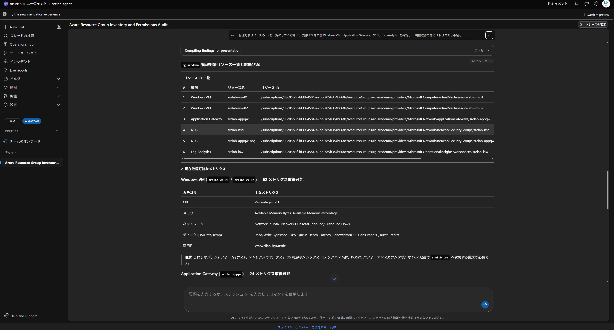
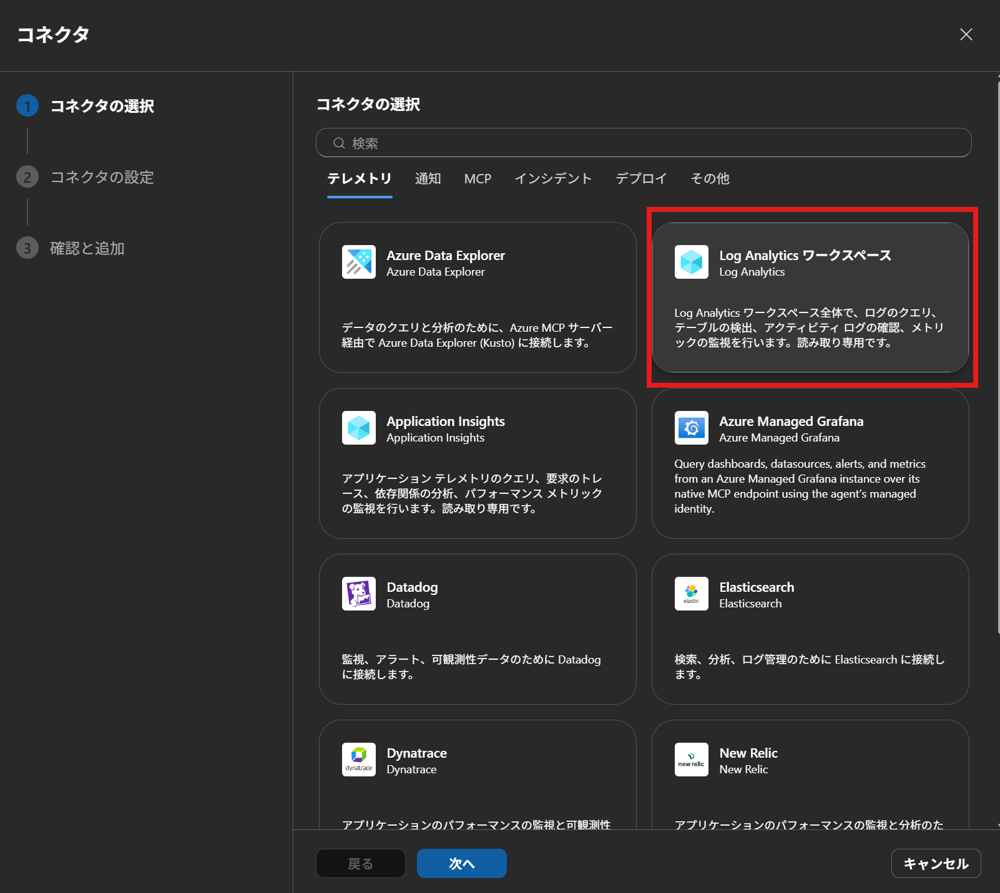
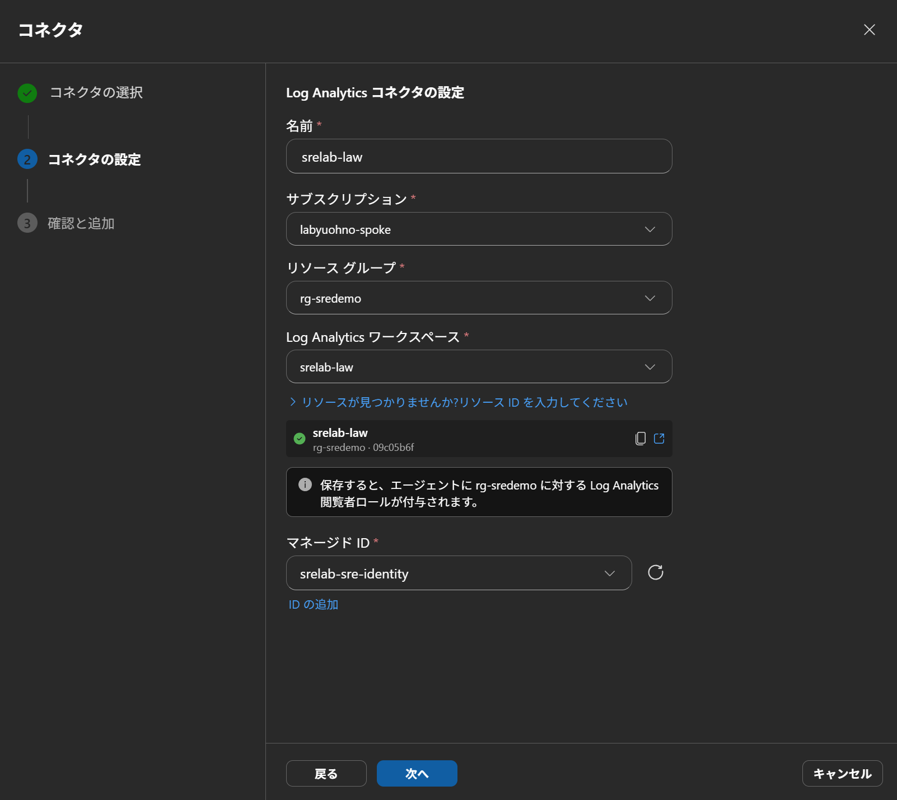
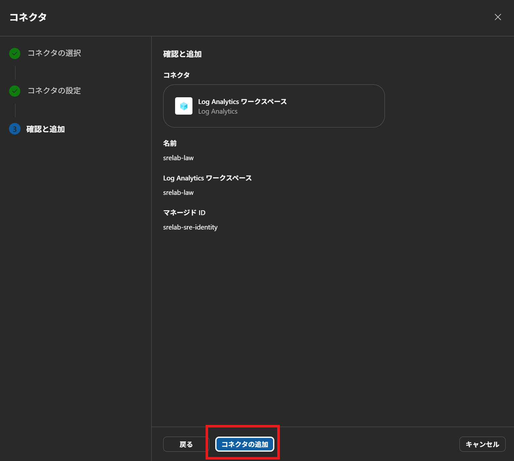
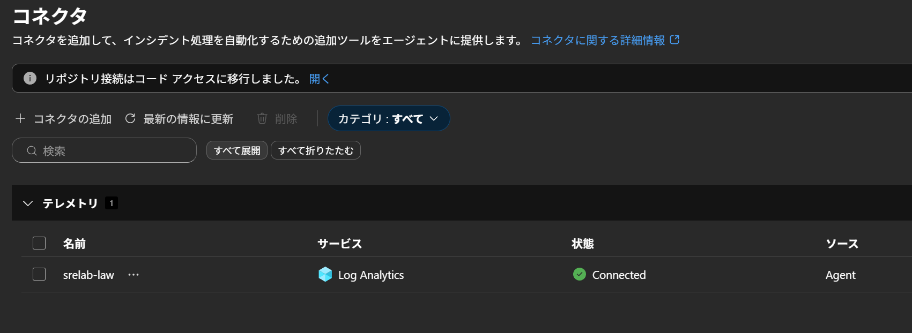
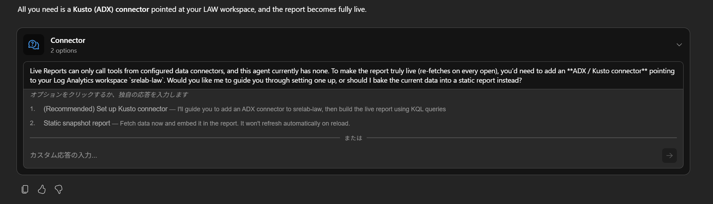
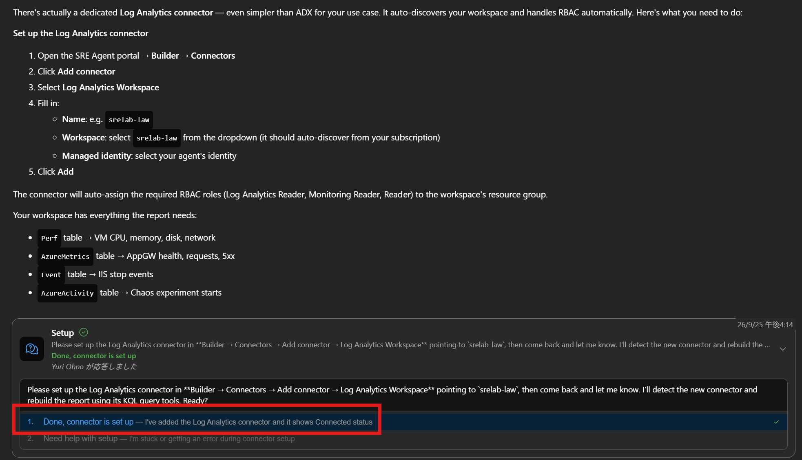
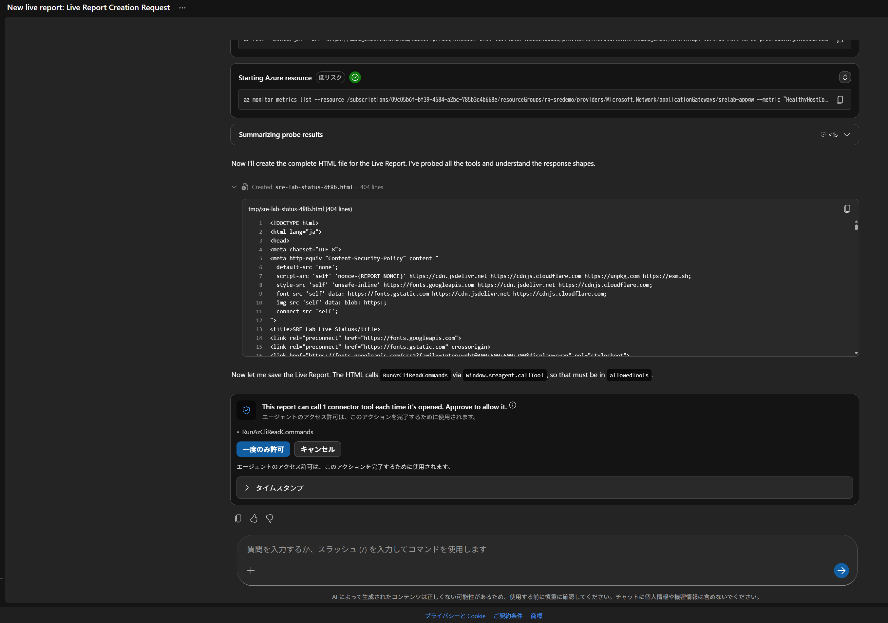
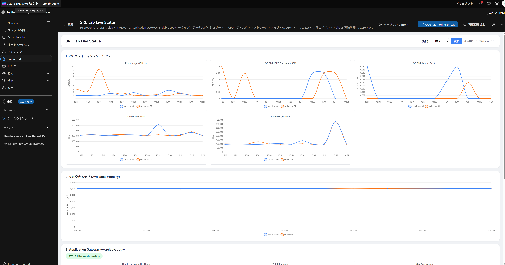
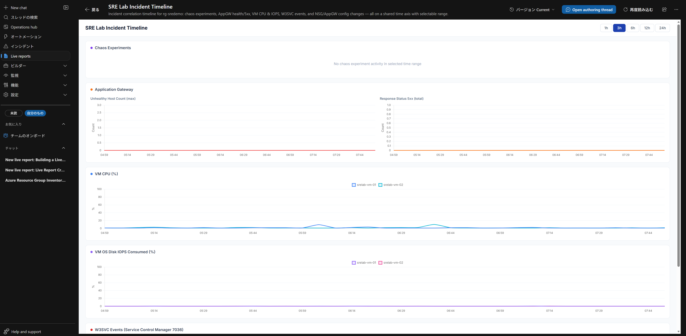

# Azure SRE Agent のセットアップ

デプロイ後に、次の 3 つを順に実施します。

1. [手順 1: 管理対象リソースと権限の確認](#手順-1-管理対象リソースと権限の確認)
2. [手順 2: ライブレポートで状態ダッシュボードを作成](#手順-2-ライブレポートで状態ダッシュボードを作成)
3. [手順 3: Azure Monitor のアラートを受信する](#手順-3-azure-monitor-のアラートを受信する)

## デプロイされる構成

`main.bicep` は SRE Agent、専用ユーザー割り当てマネージド ID、Log Analytics に接続した Application Insights、ロール割り当てを作成します。
VM の共有 Chaos ID と SRE Agent の ID は別の用途です。
VM ごとのシステム割り当て ID は Azure Monitor Agent（AMA）が使用します。

SRE Agent の `knowledgeGraphConfiguration.managedResources` には、デプロイ先 RG の ID を登録します。
その RG の Windows VM、NSG、Application Gateway、Log Analytics が対象です。
RG 内のリソースが対象であることは、サブスクリプション全体の操作権限を意味しません。

## モードと権限

| 設定 | 既定値 | 用途 |
|---|---|---|
| `sreAgentAccessLevel` | `High` | SRE ID に対象 RG の Contributor を追加 |
| `sreAgentMode` | `Review` | 修復提案を確認し、承認後に実行するデモ |
| 読み取り専用の組み合わせ | `Low` / `ReadOnly` | 調査と読み取り専用のライブレポートのみ |
| `deployerPrincipalId` | 実行者のユーザーオブジェクト ID | 利用者に SRE Agent Administrator を割り当て（ライブレポートの作成・削除を含む） |

`High` と `Review` は権限の最小化そのものではありません。
実装では RG スコープの Contributor を付与するため、読み取り中心のデモでは `Low` / `ReadOnly` を検討します。
修復が必要な場合も対象、変更差分、影響、ロールバックを確認し、最小スコープの権限で承認してください。
プロンプトの「変更しない」という指示だけを、RBAC に代わる境界として扱わないでください。

| ID / 実行者 | 実装上のスコープと権限 |
|---|---|
| デプロイ実行者 | 対象 RG の作成操作とロール割り当て操作が必要。RG 作成やプロバイダー登録は別途管理者と調整 |
| デプロイ利用者 | `main.bicep` が対象 RG に SRE Agent 用ロールと Contributor を割り当て |
| SRE ID | 対象 RG の Reader と Log Analytics Reader、High の場合のみ Contributor |
| 共有 Chaos ID | 各対象 VM の Reader |
| CPU / メモリ実験 ID | 全対象 VM の Reader |
| IIS / ディスク IO 実験 ID | 最初の VM の Reader |

VM Run Command はゲストで高い権限を持つ操作です。
実行する PowerShell 全文、VM ID、実行者、結果を記録し、サービス確認と必要な復旧以外へ権限を広げないでください。
NSG 修復は対象 NSG、プローブ修復は対象 Gateway に限定します。

## 手順 1: 管理対象リソースと権限の確認

1. 成功した main デプロイの出力 `sreAgentPortalUrl`、または [SRE Agent ポータル](https://aka.ms/sreagent/portal)を開きます。
2. 作成したエージェントを選び、対象 RG が管理リソースに含まれていることを確認します。
3. IAM で SRE ID の割り当て先が目的の RG であることを確認します。
4. チャットで下記の読み取り専用確認を実行します。

```text
管理対象リソースの ID を一覧にしてください。
対象 RG 内の全 Windows VM、Application Gateway、NSG、Log Analytics を確認し、
現在取得できるメトリクスと不足している権限を説明してください。
メトリクスは Azure CLI ではなく組み込みのメトリクス用ツールで取得してください。
失敗した操作は、ツールのエラー（ValidationError など）と RBAC の拒否（AuthorizationFailed）を区別し、エラー全文を示してください。
リソース変更や権限追加はしないでください。
```



エージェントが「Monitoring Reader が不足している」と回答しても、ロールを追加する前にエラーの種類を確認します。

| 症状 | 原因 | 対応 |
|---|---|---|
| `RunAzCliReadCommands` で `az monitor metrics list` / `list-definitions` が `ValidationError` | エージェントの CLI ツール側の制約。RBAC の判定前に拒否されている | 組み込みのメトリクス用ツール（例: `DiscoverMetrics`）で取得するよう指示する |
| コード実行サンドボックスで `Please run 'az login'` | サンドボックスの `az` はマネージド ID で認証されない | 権限確認には使わない。上記のツールで確認する |
| `AuthorizationFailed` | RBAC 不足 | 対象スコープと不足アクションを確認してから最小権限を検討する |

SRE ID には RG の Reader（`*/read`）があるため、メトリクスと診断設定の読み取りに Monitoring Reader は不要です。
NSG フローログの未構成、Application Insights（`<prefix>-sre-appinsights`）に IIS のテレメトリがないことは、このラボの設計どおりです。
この Application Insights は SRE Agent 自身のログ用です。

ポータルの表示はサービス更新やテナントで変わるため、未確認の設定ラベルを探すのではなく、リソース ID と実際の権限で確認します。
SRE Agent の利用可能リージョンや利用要件は[公式概要](https://learn.microsoft.com/azure/sre-agent/overview)で確認してください。
このラボの既定のデプロイ先は `japaneast` です。

## 手順 2: ライブレポートで状態ダッシュボードを作成

### ライブレポートとは

[ライブレポート (プレビュー)](https://learn.microsoft.com/azure/sre-agent/live-reports) は、Azure SRE Agent の機能です。
チャットで必要なビューを説明すると、エージェントがレポートを作成し、エージェントの **ライブ レポート** ページに保存します。
保存後はチャート、表、ステータス表示のレイアウトを維持したまま、データだけを再取得できます。

このラボでは、VM と Application Gateway の状態を一画面で確認する「運用ダッシュボード」としてライブレポートを使用します。
ライブレポートは SRE Agent ポータルでチャットから作成するものであり、Bicep や ARM テンプレートのリソースではありません。
そのため `main.bicep` はレポートを作成しません。
デプロイ後に、この手順でレポートを作成します。

### 前提条件

| 項目 | このラボでの準備 |
|---|---|
| レポートを作成する利用者の権限 | エージェントに対する読み書き権限が必要です。`main.bicep` はデプロイ実行者に **SRE Agent Administrator** を割り当てます。 |
| レポートを閲覧する利用者の権限 | 共有先にも **SRE Agent Standard User** または **SRE Agent Administrator** が必要です。リンクを共有しても権限は付与されません。 |
| エージェントのデータアクセス | エージェントのマネージド ID には、ラボ RG の Reader と Log Analytics Reader を割り当てています（[sre-agent.bicep](../modules/sre-agent.bicep)）。 |
| データソース | **Log Analytics コネクタが必要です**。ライブレポートは設定済みのコネクタのツールだけを呼び出します。`main.bicep` では作成しないため、[Log Analytics コネクタを追加する](#log-analytics-コネクタを追加する)の手順で追加します（[コネクタ](https://learn.microsoft.com/azure/sre-agent/connectors)）。 |
| ゲストのログ | AMA と DCR が `Perf`（CPU、メモリ、ディスク、ネットワーク）と `Event`（Service Control Manager 7036）を LAW に送ります。 |
| Chaos 実験の履歴（任意） | `AzureActivity` を使う場合は、[定期タスク](scheduled-tasks.md)に記載した `enable-activity-log.sh` でサブスクリプションの Activity Log を LAW に転送します。 |

レポートは、エージェントに設定済みのコネクタと、そのマネージド ID に付与された権限の範囲でのみデータを取得できます。
チャットで使える組み込みツールがあっても、コネクタがなければレポートを開くたびにデータを再取得できません。
レポートを作成しても、コネクタの追加や他システムへのアクセス権の付与は行われません。

### Log Analytics コネクタを追加する

レポートを作成する前に、ラボの LAW（出力 `lawName`、既定は `<prefix>-law`）に接続するコネクタを追加します。

1. エージェントの **Builder** → **コネクタ** を開き、**+ コネクタの追加** を選びます。
2. **テレメトリ** タブで **Log Analytics ワークスペース** を選び、**次へ** を選びます。

   

3. 次の値を入力し、**次へ** を選びます。

   | 項目 | 値 |
   |---|---|
   | 名前 | 任意（例: `srelab-law`） |
   | サブスクリプション / リソース グループ | ラボをデプロイしたサブスクリプションと RG |
   | Log Analytics ワークスペース | `<prefix>-law` |
   | マネージド ID | `<prefix>-sre-identity` |

   保存すると、エージェントに対象 RG の Log Analytics 閲覧者ロールが付与されます。
   `main.bicep` でも同じロールを割り当てているため、権限は増えません。

   

4. **確認と追加** で内容を確認し、**コネクタの追加** を選びます。

   

5. コネクタの一覧で、状態が **Connected** になったことを確認します。

   

### レポートの内容

| セクション | データソース | 表示内容 |
|---|---|---|
| VM ごとの CPU | Azure Monitor メトリクス `Percentage CPU` | 直近 1 時間の時系列 |
| VM ごとの空きメモリ | LAW `Perf` の `Memory` / `Available Bytes` | VM 別の MiB（時系列） |
| OS ディスク | `OS Disk IOPS Consumed Percentage`、`OS Disk Queue Depth` | IOPS 上限への到達とキューの増加 |
| ネットワーク | `Network In Total`、`Network Out Total`（補助: `Perf` の Network Interface） | VM 別の送受信量 |
| App Gateway バックエンド | `HealthyHostCount`、`UnhealthyHostCount` | 正常と異常の台数、ステータス表示 |
| App Gateway リクエスト | `TotalRequests`、`ResponseStatus` と `BackendResponseStatus`（`HttpStatusGroup = 5xx`） | リクエスト数、Gateway の 5xx と IIS の 5xx の区別 |
| IIS 停止イベント | LAW `Event`（System、Service Control Manager、Event ID 7036、W3SVC、stopped） | VM、時刻、メッセージの一覧 |
| Chaos 実験の開始履歴 | LAW `AzureActivity`（`Microsoft.Chaos/experiments/start/action`） | 実験名、開始時刻、状態、実行者 |
| アラート | 発報中と解消済みの Azure Monitor アラート | ラボ RG のアラート一覧 |

App Gateway の診断設定は `AllMetrics` を LAW に送ります。
ただし `AzureMetrics` テーブルにはディメンションが含まれないため、5xx の内訳は Azure Monitor メトリクスから取得します。
`VM Cached IOPS Consumed Percentage` は、OS ディスクが caching=None のためデータが出ない場合があります。

### 作成手順

1. デプロイ出力 `sreAgentPortalUrl`（`deploy.sh` の場合は表示される **SRE Agent** のリンク）からエージェントを開きます。
2. ナビゲーションで **ライブ レポート** を選びます。
3. **+ 新しいレポート** を選びます。エージェントが利用可能なツールを確認します。
4. 下記のプロンプトを入力し、エージェントからの追加の質問に答えます。
5. エージェントが「コネクタが設定されていない」と尋ねた場合は、**Static snapshot report** を選ばずにコネクタを設定します。
   静的なレポートは、再読み込みしてもデータが更新されません。

   

   エージェントは ADX (Kusto) コネクタを提案することがありますが、LAW には専用の Log Analytics コネクタのほうが簡単です。
   [Log Analytics コネクタを追加する](#log-analytics-コネクタを追加する)の手順で追加し、**Done, connector is set up** を選んで完了を伝えます。
   エージェントが新しいコネクタを検出し、KQL クエリでレポートを作り直します。

   

6. レポートが開くたびに呼び出すツールの承認を求められます。ツール名を確認し、**読み取り専用のツールだけを承認**します。

   

7. レポートが保存され、ギャラリーに表示されるまで待ちます。

#### プロンプト例 1: ラボの状態ダッシュボード

`<RG>`、`<prefix>`、`<LAW 名>` は、デプロイ出力の `resourceGroupName`、パラメータの `prefix`、出力の `lawName` に置き換えます。

```text
「SRE Lab Live Status」という名前のライブレポートを作成してください。
対象はリソースグループ <RG> の Windows VM（<prefix>-vm-01、<prefix>-vm-02 …）と
Application Gateway <prefix>-appgw です。既定の期間は直近 1 時間とし、期間セレクターを付けてください。

1. VM ごとの時系列チャート（Azure Monitor メトリクス）:
   Percentage CPU、OS Disk IOPS Consumed Percentage、OS Disk Queue Depth、
   Network In Total、Network Out Total
2. VM ごとの空きメモリの時系列チャート:
   Log Analytics ワークスペース <LAW 名> の Perf テーブル、ObjectName "Memory"、CounterName "Available Bytes"（MiB 表示）
3. Application Gateway のステータス表示と時系列チャート:
   HealthyHostCount、UnhealthyHostCount、TotalRequests、
   ResponseStatus と BackendResponseStatus の HttpStatusGroup = 5xx を別々のシリーズで表示
   UnhealthyHostCount が 1 以上なら異常のステータスにしてください
4. IIS 停止イベントの表（新しい順）:
   Event テーブル、System ログ、Source "Service Control Manager"、EventID 7036、
   W3SVC（World Wide Web Publishing Service）が stopped になったイベント
5. Chaos 実験の開始履歴の表:
   AzureActivity テーブルの OperationNameValue "Microsoft.Chaos/experiments/start/action"、
   ResourceGroup が <RG> のもの。テーブルがない、または空の場合はその旨を表示してください
6. ラボ RG の Azure Monitor アラートの表（発報中と解消済み、重大度、対象、時刻）

データはコネクタとツールの結果だけで表示し、モデルによる要約セクションは作成しないでください。
リソースを変更するボタンやアクションは追加せず、読み取り専用のツールだけを使用してください。
欠損値は 0 として描画せず、データなしと表示してください。
```

出力例としては以下のようなダッシュボードが出力されます。



モデルによる要約や分析のセクションは、更新のたびに AAU を消費します。
このため、状態ダッシュボードは表示のみで作成し、原因分析はチャットで個別に依頼します。

#### プロンプト例 2: 障害デモ用タイムライン

障害注入の前後を 1 画面で比較する場合に作成します。

```text
「SRE Lab Incident Timeline」という名前のライブレポートを作成してください。
対象はリソースグループ <RG> です。既定の期間は直近 3 時間とし、期間セレクターを付けてください。

- Chaos 実験の開始と終了（Chaos Studio の実験の実行履歴、または AzureActivity）
- Application Gateway の UnhealthyHostCount と ResponseStatus 5xx の時系列
- <prefix>-vm-01 と <prefix>-vm-02 の Percentage CPU、OS Disk IOPS Consumed Percentage の時系列
- W3SVC 停止イベント（Event、Service Control Manager、7036）
- NSG <prefix>-nsg と Application Gateway の構成変更（AzureActivity の書き込み操作と削除操作）

これらを同じ時間軸に並べてください。
表示のみとし、モデルによる要約、リソース変更のボタンやアクションは追加しないでください。
```

出力例として、以下のようなダッシュボードが出力されます。



### レポートを開き、再読み込みして更新する

1. **ライブ レポート** に戻り、レポートのタイルを選びます。
2. 現在のチャート、表、ステータス表示を確認します。
3. レポートは最大 5 分間キャッシュされたツールの結果を使う場合があります。障害デモ中は **再読み込み** を選び、最新のデータを取得します。
4. レイアウト、フィルター、データソースを変更する場合は、**作成スレッドを開く** を選び、チャットで変更点を伝えて新しいバージョンを保存させます。
5. バージョン ピッカーで以前のバージョンを確認できます。以前のバージョンに保存されるのはレイアウトと構成であり、過去のデータではありません。

公式ドキュメントに一定間隔の自動更新機能の記載はありません。
デモでは、障害注入後や復旧後に **再読み込み** を選びます。
AMA の `Perf` / `Event` と Activity Log は、取り込みに数分かかることがあります。
再読み込みしても、データの到着が遅れている場合は反映されません。

### 共有、エクスポート、削除

- **共有**: **レポートへのリンクをコピー** を選びます。共有先には、エージェントに対する SRE Agent Standard User または SRE Agent Administrator のロールが必要です。
- **エクスポート**: オーバーフロー メニューの **HTML のダウンロード** で、静的なスナップショットを保存します。ファイルにはリソース名や IP アドレスが含まれるため、取り扱いに注意します。
- **削除**: オーバーフロー メニューの **削除** で完全に削除します。SRE Agent Administrator のロールが必要です。

レポートはエージェントに保存されます。
`cleanup.sh` でラボ RG を削除するとエージェントも削除されるため、残したいレポートは事前に HTML で保存します。
ダウンロードした HTML はローカルファイルのため、`cleanup.sh` では削除されません。

### 使用量とコスト

- ライブレポートの作成と、既存レポートの更新（レイアウトの変更など）は、アクティブ フローの AAU を消費します。
- コネクタとツールでデータを取得するだけの再読み込みは、アクティブ フローの AAU を消費しません。
- モデルによる要約や分析を含むレポートは、再読み込みのたびに AAU を消費します。
- プレビューでは、レポートごとやユーザーごとの AAU 予算を設定できません。モデルの呼び出しを繰り返すレポートは作成しないでください。

消費量はエージェントの **設定** > **エージェントの消費** で確認します。
料金は[価格と課金](https://learn.microsoft.com/azure/sre-agent/pricing-billing)を参照してください。

### プレビューの制限事項

- 別のテナントからエージェントにアクセスした場合、レポートのツール呼び出しを承認できません。テナント間で共有するレポートには、承認が必要なツールを含めないでください。
- 生成されるレポートの HTML は 10 MB 以下である必要があります。
- モデルがレート制限された場合、そのセクションは HTTP 429 を返します。時間をおいて再試行します。

### チャットでその場のレポートを依頼する

保存するほどではない確認は、ライブレポートではなくエージェントとのチャットで依頼します。
チャットでの依頼はその都度 AAU を消費し、結果は保存されたダッシュボードとしては残りません。

```text
rg-sreagentlab の全 VM と App Gateway について、直近 30 分のメトリックとアラート状況を表にまとめ、
異常があれば原因候補を挙げてください。
各値の期間と取得時刻、根拠としたメトリックやログ、欠損や未確認事項も示してください。
読み取り専用で調査し、修復やリソースの変更はしないでください。
```

RG 名は実際の値に置き換えてください。

### 参考: Log Analytics のクエリ

レポートの作成時にエージェントが生成したクエリを確認する場合や、作成スレッドでクエリを指定する場合に使用します。
`<VM 名の接頭辞>` は `<prefix>-vm-` に置き換えます。

```kusto
// VM ごとの空きメモリ (MiB)
Perf
| where TimeGenerated > ago(1h)
| where Computer startswith "<VM 名の接頭辞>"
| where ObjectName == "Memory" and CounterName == "Available Bytes"
| summarize AvailableMiB = avg(CounterValue) / 1048576.0 by Computer, bin(TimeGenerated, 1m)
| order by TimeGenerated asc
```

```kusto
// W3SVC の停止イベント (Service Control Manager 7036)
Event
| where TimeGenerated > ago(24h)
| where Computer startswith "<VM 名の接頭辞>"
| where EventLog == "System" and Source == "Service Control Manager" and EventID == 7036
| where RenderedDescription has_any ("World Wide Web Publishing Service", "W3SVC")
    and RenderedDescription has "stopped"
| project TimeGenerated, Computer, RenderedDescription
| order by TimeGenerated desc
```

```kusto
// Chaos 実験の開始履歴 (任意の Activity Log 転送が必要)
AzureActivity
| where TimeGenerated > ago(24h)
| where ResourceGroup =~ "<RG>"
| where OperationNameValue =~ "Microsoft.Chaos/experiments/start/action"
| project TimeGenerated, Resource = tostring(split(ResourceId, "/")[-1]), ActivityStatusValue, Caller, CorrelationId
| order by TimeGenerated desc
```

### トラブルシューティング

| 症状 | 確認すること |
|---|---|
| 「コネクタが設定されていない」と表示される | [Log Analytics コネクタ](#log-analytics-コネクタを追加する)を追加し、状態が Connected か |
| エージェントがレポートを作成できない | 利用者にエージェントの読み書き権限があるか、必要なツールとコネクタが正常か |
| データが古く見える | **再読み込み** でキャッシュを回避したか、データソースに新しいデータが届いているか |
| メモリやイベントの表が空 | AMA 拡張機能と DCR の関連付け、`Perf` / `Event` の取り込み遅延 |
| Chaos 実験の履歴が空 | `enable-activity-log.sh` を実行したか。転送は有効化以降の操作のみが対象 |
| 5xx が 0 のまま | ブラウザなどでリクエストを送ったか。Gateway が返す 502 は BackendResponseStatus に含まれない |
| ディスクのメトリクスがない | VM サイズがディスク指標に対応しているか（既定は `Standard_D2s_v5`） |

空のセクションは、障害がないことの証拠ではありません。
対象リソース、期間、ツールの権限、データの到着を順に確認してください。

画面の項目名は日本語版ドキュメントの訳語に基づきます。
実際の表示がプレビュー中に変わる場合があるため、ポータルの表示を優先してください。

## 手順 3: Azure Monitor のアラートを受信する

Azure Monitor のアラートが発報しても、インシデント プラットフォームを接続していないと SRE Agent は受信しません。
エージェント作成時のオンボーディングで Azure Monitor を選ばなかった場合も、後から次の手順で接続できます。
`main.bicep` はこの接続を構成しません。

### Azure Monitor を接続する

1. エージェントの **Incidents** → **Triggers + response plans**（または **Builder** → **インシデント プラットフォーム**）を開きます。
2. **Connect an incident platform** を選び、**Azure Monitor** を選んで保存します。
   資格情報は不要で、エージェントのマネージド ID で認証します。
   有効にできるインシデント プラットフォームは 1 つだけです。PagerDuty や ServiceNow を接続済みの場合は切り替わります。
3. **Azure Monitor connected** と表示されることを確認します。

接続しただけでは、アラートは調査されません。
SRE Agent は届いたアラートを応答プランと照合し、一致したものだけを調査します。

### 応答プランを作成する

接続時に既定の応答プラン `quickstart_handler`（Sev0～Sev2、自律モード）が作られる場合があります。
ただし、オンボーディング後に接続した場合などは作られないことがあります。
このラボでは、承認付き修復を実演するため、次の手順で専用の応答プランを作成します。

1. **インシデント** → **Triggers & response plans** で、**+ 対応計画の作成**（プランがない場合は **Add an incident response plan**）を選びます。
2. **ステップ 1: 対応プラン** で次を設定し、**次へ** を選びます。

   | 項目 | 設定 |
   |---|---|
   | インシデント対応計画名 | 例: `srelab-alerts-review` |
   | 重要度 | **Sev1** と **Sev2**（CPU、ディスク、メモリが Sev2、IIS 停止、Gateway の Unhealthy と backend 5xx が Sev1）。frontend 5xx は Sev3 のため対象外 |
   | タイトルに含む / タイトルが次の値を含まない | 空欄 |
   | 応答エージェント | 既定のエージェント |
   | エージェントの自律性レベル | **レビュー**（既定は Autonomous のため変更する） |
   | アラートの再調査のクールダウン | 任意。デモで同じアラートを繰り返し発報させる場合は無効のままにする |

3. **ステップ 2: インシデントのプレビュー** で期間を **過去 7 日間** などにし、ラボのアラート（例: `<prefix>-<prefix>-vm-01-high-cpu-alert`）が一覧に表示されることを確認します。
   表示されない場合は **戻る** で重大度などの条件を見直します。一覧が空の場合は、期間内に条件に合うアラートがありません。
4. **作成** を選び、プランの状態が **オン**、モードが **レビュー** であることを確認します。
5. `quickstart_handler` がある場合は、二重に処理されないよう、**表ビュー** で削除するか **無効にする** で無効にします。

### 受信を確認する

1. アラートを発報させるか、発報中のアラートがある状態で数分待ちます。
   スキャナーは 1 分ごとに確認し、初回は過去 1 日分を読み込みます。同じルールの繰り返し発報は 1 つのスレッドにまとめられます。
2. チャットにインシデント カードが表示され、Azure Monitor のアラートの状態が `New` から `Acknowledged` に変わることを確認します。
3. Review モードでは、エージェントが調査結果と修復案を提示し、承認を待ちます。

アラートが表示されない場合は、次を確認します。

| 確認項目 | 内容 |
|---|---|
| アラートが発報しているか | Azure Monitor の **アラート** 一覧で、対象 RG のアラートが発生しているか |
| 応答プランがあるか | **Triggers + response plans** に、状態が **On** のプランがあるか |
| 応答プランの対象か | アラートの重大度とタイトルがプランの条件に合うか。**Incidents preview** で一覧に出るか |
| アラートの状態 | `New` のままなら未取り込み。応答プランの有無と条件を確認する |
| マネージド ID の権限 | 公式ドキュメントでは、エージェントのマネージド ID にサブスクリプションの **Monitoring Contributor** が必要とされています。`main.bicep` は RG スコープのロールしか割り当てないため、不足していれば管理者が割り当てます |

詳細は[Azure Monitor アラート](https://learn.microsoft.com/azure/sre-agent/azure-monitor-alerts)、[インシデント応答の自動化](https://learn.microsoft.com/azure/sre-agent/automate-incidents)、[インシデント応答プラン](https://learn.microsoft.com/azure/sre-agent/incident-response-plans)を参照してください。

## アラートとインシデント対応

`monitoring.bicep` は次の監視を作成します。

| 対象 | 条件 / データソース |
|---|---|
| 各 VM の CPU | Percentage CPU の 5 分平均 > 60% |
| 各 VM の OS ディスク | IOPS 消費率の 5 分平均 > 90%、キュー深度の 5 分平均 > 10 |
| Cached IOPS | 5 分平均 > 90%。caching=None ではデータ欠損があり得る参考指標 |
| メモリ | `Perf` の Available Bytes の 5 分平均 < 3 GiB |
| IIS 停止 | `Event` の SCM 7036、W3SVC / World Wide Web Publishing Service の stopped |
| Gateway | UnhealthyHostCount の 5 分平均 >= 1（Sev1）、backend 5xx の 5 分合計 > 0（Sev1）、frontend 5xx の 5 分合計 > 0（Sev3） |

IIS イベントの状態文字列は、このラボで使用する英語 Windows イメージを前提にしています。
NSG やプローブの誤設定では、UnhealthyHostCount と frontend 5xx が同じ原因でほぼ同時に発報します。
別々のインシデントとして二重に調査・修復されないよう、原因に近い UnhealthyHostCount を Sev1、症状である frontend 5xx を Sev3 にしています。
frontend 5xx はメール通知とライブレポートでの確認に使い、応答プランの対象には含めません。
App Gateway の診断設定は `AllMetrics` のみであり、アクセスログやファイアウォールログを追加する必要はありません。
SRE Agent のライブレポートでは、Gateway の 5xx の内訳などディメンション付きの値を Azure Monitor メトリクスから取得します（`AzureMetrics` テーブルにはディメンションが含まれません）。

Azure Monitor のアラートを SRE Agent で自動調査するには、[手順 3](#手順-3-azure-monitor-のアラートを受信する)の接続が必要です。
連携が未設定でも、チャットから対象アラートと期間を指定して調査できます。

## 安全な修復の実演

```text
現在のアラートと実験状態を読み取り、原因候補と証拠を示してください。
対象 ID、変更前後の差分、想定影響、ロールバック、必要最小限の権限を提示して承認を待ってください。
Chaos 所有の操作は実験停止を優先し、NSG は ManualDenyAppGatewayHTTP だけを修復対象にしてください。
承認後の操作と復旧確認結果を記録してください。
```

IIS 実験停止後に W3SVC が復旧していなければ、`fix-iis.sh` または承認済み Run Command で確認して起動します。
ディスクや VM のサイズを自動変更するデモにはしません。
詳細は[Runbook](runbook-template.md)に従います。

## 追加の読み取り権限

Activity Log を Log Analytics に送る診断設定はサブスクリプションスコープです。
任意の `enable-activity-log.sh` は、当該スコープに診断設定を作成できる管理者が実行します。
SRE Agent にサブスクリプションの Contributor や Owner を暗黙に追加する手順ではありません。
取り込み済み `AzureActivity` の読み取りと、エクスポート設定の作成権限を区別してください。

Cost Management の取得には別の API と、対象のコストスコープに合った読み取り権限が必要です。
Azure RBAC スコープの Cost Management Reader と、契約に応じた課金スコープの Billing reader 等の権限は、管理者が別途確認します。
RG の管理リソース指定だけで、請求アカウントの費用が読めるとは限りません。
[定期タスク](scheduled-tasks.md)では、利用できないデータを未取得として報告します。

## 関連手順と公式ドキュメント

- [8 シナリオ](demo-scenario.md)
- [定期タスク](scheduled-tasks.md)
- [ポータルによる Windows 構成](azure-portal-manual-setup.md)
- [Azure SRE Agent のライブ レポート (プレビュー)](https://learn.microsoft.com/azure/sre-agent/live-reports)
- [Azure SRE Agent のコネクタ](https://learn.microsoft.com/azure/sre-agent/connectors)
- [ユーザーのロールとアクセス許可](https://learn.microsoft.com/azure/sre-agent/user-roles)
- [ツールのアクセス ポリシー](https://learn.microsoft.com/azure/sre-agent/tool-access-policies)
- [価格と課金](https://learn.microsoft.com/azure/sre-agent/pricing-billing)
