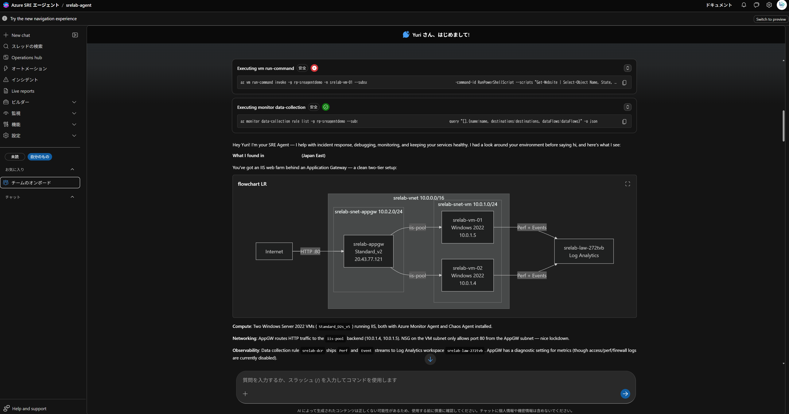
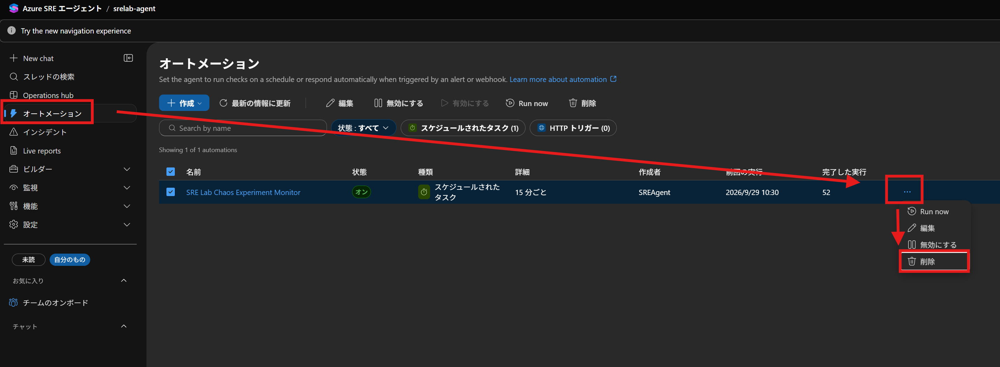
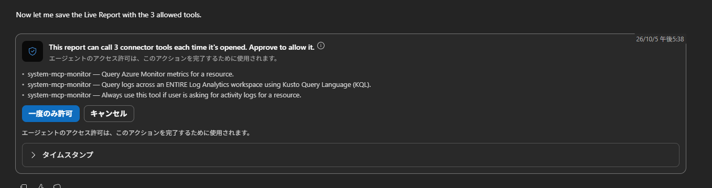
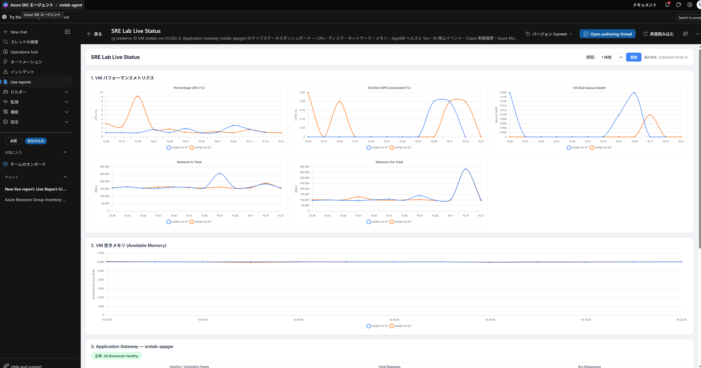
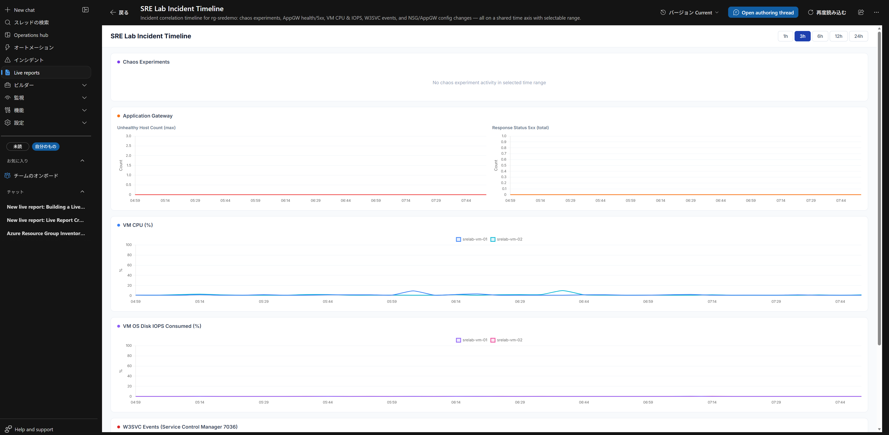

# Azure SRE Agent のセットアップ

この文書は、ポータル項目、権限、ライブレポート、定期タスクの詳細リファレンスです。
初めて設定する場合は、[ステップバイステップ ハンズオン](sre-agent-hands-on.md)を Level 1 から進めてください。

デプロイ後に、次の 5 つを順に実施します。

1. [手順 1: 初回オンボーディングで Azure Monitor を接続](#手順-1-初回オンボーディングで-azure-monitor-を接続)
2. [手順 2: `/learn` の実行結果を確認](#手順-2-learn-の実行結果を確認)
3. [手順 3: ライブレポートで状態ダッシュボードを作成](#手順-3-ライブレポートで状態ダッシュボードを作成)
4. [手順 4: 応答プランを作成してアラート受信を確認](#手順-4-応答プランを作成してアラート受信を確認)
5. [手順 5: 毎朝 9 時 JST の定期タスクを作成](#手順-5-毎朝-9-時-jst-の定期タスクを作成)

## デプロイされる構成

デプロイした Bicep テンプレートでは、SRE Agent、専用ユーザー割り当てマネージド ID、Log Analytics に接続した Application Insights、ロール割り当てを作成します。

SRE Agent の `knowledgeGraphConfiguration.managedResources` には、デプロイ先 RG の ID を登録します。
その RG の Windows VM、NSG、Application Gateway、Log Analytics が対象です。
RG 内のリソースが対象であることは、サブスクリプション全体の操作権限を意味しません。

## モードと権限

| 設定 | 既定値 | 用途 |
|---|---|---|
| `sreAgentAccessLevel` | `High` | SRE ID に対象 RG の Contributor を追加 |
| `sreAgentMode` | `Review` | 修復提案を確認し、承認後に実行するデモ |
| `deployerPrincipalId` | 実行者のユーザーオブジェクト ID | 利用者に SRE Agent Administrator を割り当て（ライブレポートの作成・削除を含む） |

「読み取り専用の組み合わせ」は独立した Bicep 設定ではありません。
読み取り中心のデモにする場合は、`sreAgentAccessLevel` に `Low`、`sreAgentMode` に `ReadOnly` をそれぞれ指定します。

`High` と `Review` は権限の最小化そのものではありません。
実装では RG スコープの Contributor を付与するため、読み取り中心のデモでは `Low` / `ReadOnly` を検討します。
修復が必要な場合も対象、変更差分、影響、ロールバックを確認し、最小スコープの権限で承認してください。
プロンプトの「変更しない」という指示だけを、RBAC に代わる境界として扱わないでください。

| ID / 実行者 | 実装上のスコープと権限 |
|---|---|
| デプロイ実行者 | 対象 RG の作成操作とロール割り当て操作が必要。RG 作成やプロバイダー登録は別途管理者と調整 |
| デプロイ利用者 | `main.bicep` が対象 RG に SRE Agent 用ロールと Contributor を割り当て |
| SRE ID | 対象 RG の Reader と Log Analytics Reader、High の場合のみ Contributor。公式の Azure Monitor アラート連携手順はサブスクリプションの Monitoring Contributor を要求するため、[応答プランの手順](#手順-4-応答プランを作成してアラート受信を確認)で実効ロールを確認 |
| 共有 Chaos ID | 各対象 VM の Reader |
| CPU / メモリ実験 ID | 全対象 VM の Reader |
| IIS / ディスク IO 実験 ID | 最初の VM の Reader |

VM Run Command はゲスト OS で Administrator 権限を持つ操作が行えます。
実行する PowerShell、VM ID、実行者、結果を記録し、サービス確認と必要な復旧以外へ権限を広げないでください。
NSG 修復は対象 NSG、プローブ修復は対象 Gateway に限定します。

## 手順 1: 初回オンボーディングで Azure Monitor を接続

SRE Agent を初めて開くと、オンボーディング画面が表示されます。
ライブレポートを作成する前に、この画面でインシデント プラットフォームを設定します。
`main.bicep` ではこの接続を構成しません。

1. 成功した main デプロイの出力 `sreAgentPortalUrl`、または [SRE Agent ポータル](https://aka.ms/sreagent/portal)を開きます。
2. 作成したエージェントを選び、オンボーディングを開始します。
3. インシデント プラットフォームに **Azure Monitor** を選び、接続を保存します。
   資格情報は不要で、エージェントのマネージド ID で認証します。
   有効にできるインシデント プラットフォームは 1 つだけです。
4. "完了してエージェントに移動" を選択しオンボーディングを完了します。

## 手順 2: `/learn` の実行結果を確認

初回オンボーディング時に SRE Agent が作成した `/learn` スレッド (これは SRE Agent ポータルで左側の "チームのオンボード"　の内容) を開きます。
同じ初期調査を新しいチャットで繰り返す必要はありません。
まず実行結果をデプロイ出力の `resourceGroupName` と照合し、次を確認します。

1. サブスクリプション、RG、リージョンと、対象の Windows VM、Application Gateway、NSG、Log Analytics のリソース ID。
2. VM と Gateway の初期正常性、Azure Monitor アラート、Chaos Studio 実験の一覧。
3. メトリクスと `Perf` / `Event` / `Heartbeat` の取得期間・確認時刻。未取得と正常値の区別。
4. 取得できないログ、未接続のコネクタ、権限不足などの未確認事項と、メモリに保存されたファイル（スレッドに `Created memory: logs.md` のように表示されます）。これらはナレッジ ソースには表示されません。



`/learn` が定期監視タスクを作成した場合は、タスク名、頻度、調査内容、自律性レベルを確認します。
ハンズオンに不要なタスクは無効化または削除し、意図しない継続実行と AAU 消費を避けてください。



ポータルの表示はサービス更新やテナントで変わるため、随時 [公式概要](https://learn.microsoft.com/azure/sre-agent/overview) をご確認ください。
このラボの既定のデプロイ先は `japaneast` です。

## 手順 3: ライブレポートで状態ダッシュボードを作成

### ライブレポートとは

[ライブレポート (プレビュー)](https://learn.microsoft.com/azure/sre-agent/live-reports) は、Azure SRE Agent の機能です。
チャットで必要なビューを説明すると、エージェントがレポートを作成し、エージェントの **ライブ レポート** ページに保存します。
保存後はチャート、表、ステータス表示のレイアウトを維持したまま、データだけを再取得できます。

このラボでは、VM と Application Gateway の状態を一画面で確認する「運用ダッシュボード」としてライブレポートを使用します。
ライブレポートは SRE Agent ポータルでチャットから作成するものであり、Bicep や ARM テンプレートのリソースではありません。
そのため `main.bicep` はレポートを作成しません。
デプロイ後に、この手順でレポートを作成します。

### 前提条件

| 項目 | このラボでの準備 |
|---|---|
| レポートを作成する利用者の権限 | エージェントに対する読み書き権限が必要です。`main.bicep` はデプロイ実行者に **SRE Agent Administrator** を割り当てます。 |
| レポートを閲覧する利用者の権限 | 共有先にも **SRE Agent Standard User** または **SRE Agent Administrator** が必要です。リンクを共有しても権限は付与されません。 |
| エージェントのデータアクセス | エージェントのマネージド ID には、ラボ RG の Reader と Log Analytics Reader を割り当てています（[sre-agent.bicep](../modules/sre-agent.bicep)）。 |
| レポートの取得ツール | 実機で利用できた `system-mcp-monitor` の `monitor_metrics_query`、`monitor_workspace_log_query`、`monitor_activitylog_list` の 3 つを、レポート作成時のツール一覧と実行結果で確認します。ユーザーが追加した MCP コネクタとして **ビルダー** → **コネクタ** に表示されるとは限りません。 |
| Azure Monitor のプラットフォームメトリクス | `monitor_metrics_query` で VM と Application Gateway のメトリクスを取得します。`max-buckets` を 60 に指定し、期間に合うサンプル間隔を選びます。 |
| ゲストのログ | AMA と DCR が `Perf`（CPU、メモリ、ディスク、ネットワーク）と `Event`（Service Control Manager 7036）を LAW に送ります。 |
| LAW のログ | `monitor_workspace_log_query` でラボ LAW の `Perf` / `Event` を取得します。ワークスペース ID（GUID）とデプロイ出力 `lawId`（ARM リソース ID）は異なります。 |
| Activity Log の履歴 | `monitor_activitylog_list` で既知の Chaos 実験とアラートルールの操作履歴を直接取得します。このレポートのために LAW への Activity Log 転送は不要です。ツールがリソース名を要求する環境では、対象を実際の名前で列挙します。 |
| アラートの発報状態 | この 3 ツールには Alerts Management のアラート インスタンス取得機能がないため、`Fired` / `Resolved` はレポートに表示しません。Azure Monitor の **アラート** で別途確認します。 |

Azure 監視系には[コネクタ追加が不要な組み込みツール](https://learn.microsoft.com/azure/sre-agent/tools#built-in-tools)もあります。ライブレポートは作成時に利用できたツールでデータを取得し、保存した構成に従って再読み込みします（[ライブレポート](https://learn.microsoft.com/azure/sre-agent/live-reports#how-live-reports-work)）。`system-mcp-monitor` というツール名だけからユーザーが MCP コネクタを作成したとは判断しません。
ツールの実行には対象リソースへの読み取り権限が必要です。レポート作成時のツール承認は呼び出しを許可する操作であり、新しいコネクタの作成や RBAC の付与ではありません。

### レポート用 Azure Monitor ツールを確認する

実機では `system-mcp-monitor` から次の 3 つの読み取りツールが提供されました。**Capabilities** → **Tools** で利用可能なツールを探し、さらにレポート作成時に提示されるツールと実行結果を確認します（[ツール一覧](https://learn.microsoft.com/azure/sre-agent/global-tools-page)）。**ビルダー** → **コネクタ** に `system-mcp-monitor` が表示されなくても、それだけではツール未提供とは判断しません。

| `allowedTools` に指定するツール | 用途 |
|---|---|
| `system-mcp-monitor_monitor_metrics_query` | VM / Application Gateway のメトリクス |
| `system-mcp-monitor_monitor_workspace_log_query` | LAW の `Perf` / `Event` |
| `system-mcp-monitor_monitor_activitylog_list` | Chaos 実験とアラートルールの Activity Log |

1. デプロイ出力の `lawName` と `experimentNames`、実際の VM / Application Gateway 名を確認します。LAW のワークスペース ID（GUID）は Azure ポータルで確認します。`lawId` は ARM リソース ID なのでワークスペース ID の欄に入力しません。
2. Azure Monitor の **アラート ルール** でラボ RG を絞り、変更履歴に含めたいルールの名前を確認して控えます。ツールがリソース名を必須とする場合、ワイルドカードでは追加の実験やルールを自動検出できません。前回の実機では 4 実験と 8 ルールを対象にしましたが、デプロイごとの実在リソースでリストを作り直します。
3. レポート作成時の `allowedTools` と実際のツール呼び出しを確認し、3 ツールの実行結果を対象サブスクリプション、RG、LAW と照合します。ツールがない、失敗する、または権限が不足する場合は作成を止め、必要な読み取りアクセスを管理者に確認します。書き込み可能なツールやサブスクリプション Contributor を代替として追加しません。

個別の Log Analytics コネクタは、この 3 ツールが利用できる環境では状態ダッシュボードの必須条件ではありません。追加のデータソースが必要なときだけ、その接続方法と権限を別途確認します。

### レポートの内容

| セクション | データソース | 表示内容 |
|---|---|---|
| VM ごとの CPU | Azure Monitor メトリクス `Percentage CPU` | 直近 1 時間の時系列 |
| VM ごとの空きメモリ | LAW `Perf` の `Memory` / `Available Bytes` | VM 別の MiB（時系列） |
| OS ディスク | `OS Disk IOPS Consumed Percentage`、`OS Disk Queue Depth` | IOPS 上限への到達とキューの増加 |
| ネットワーク | `Network In Total`、`Network Out Total`（補助: `Perf` の Network Interface） | VM 別の送受信量 |
| App Gateway バックエンド | `HealthyHostCount`、`UnhealthyHostCount` | 正常と異常の台数、ステータス表示 |
| App Gateway リクエスト | `TotalRequests`、`ResponseStatus` と `BackendResponseStatus`（`HttpStatusGroup = 5xx`） | リクエスト数、Gateway の 5xx と IIS の 5xx の区別 |
| IIS 停止イベント | LAW `Event`（System、Service Control Manager、Event ID 7036、W3SVC、stopped） | VM、時刻、メッセージの一覧 |
| Chaos 実験の操作履歴 | Azure Monitor Activity Log（既知の実験名ごとの start / cancel アクション） | 実験名、操作時刻、操作結果。これだけで実験の現在の実行状態を断定しない |
| アラートルールの構成変更履歴 | Azure Monitor Activity Log（既知のルール名ごとの操作） | ルール名、操作時刻、操作結果。`Fired` / `Resolved` の発報状態や通知履歴ではないことを明記 |

App Gateway の診断設定は `AllMetrics` を LAW に送ります。
ただし `AzureMetrics` テーブルにはディメンションが含まれないため、5xx の内訳は Azure Monitor メトリクスから取得します。
`VM Cached IOPS Consumed Percentage` は、OS ディスクが caching=None のためデータが出ない場合があります。
VM と Gateway のプラットフォームメトリクスは Azure Monitor メトリクス取得ツールから取得します。Perf のカウンターと同じ値として扱わないでください。
各値にはサンプル時刻と取得時刻を付けます。比較するバックエンドの状態は同じサンプル時刻と同じディメンションの値にそろえ、期間内最大値は最新値と別の系列として表示します。
有効なサンプルがない場合は「データなし」、一部欠損がある場合は取得件数と対象件数を表示します。欠損を 0 に置き換えません。

### 作成手順

先に、[レポート用 Azure Monitor ツール](#レポート用-azure-monitor-ツールを確認する)が利用できることと、対象リソース名を確認します。3 ツールのいずれかが使えなければ作成を保留します。`Fired` / `Resolved` は本レポートの対象外です。

1. デプロイ出力 `sreAgentPortalUrl`（`deploy.sh` の場合は表示される **SRE Agent** のリンク）からエージェントを開きます。
2. ナビゲーションで **ライブ レポート** を選びます。
3. **+ 新しいレポート** を選びます。エージェントが利用可能なツールを確認します。
4. 下記のプロンプトを入力し、エージェントからの追加の質問に答えます。
5. レポートが使用するツールの承認を求められたら、ツール名と引数を照合し、読み取り専用の 3 ツールだけを承認します。下の画面では、確認後に **一度のみ許可** を選びます。この承認は新しいコネクタの追加ではありません。

   

6. ツールが呼び出せない場合は、権限を広げて代用したり、警告カードのあるレポートを完成扱いにしたりせず、保存を保留します。

7. レポートが保存され、ギャラリーに表示されるまで待ちます。

#### プロンプト例 1: ラボの状態ダッシュボード

`<サブスクリプション ID>`、`<RG>`、`<prefix>`、`<LAW 名>`、`<ワークスペース ID>` を対象環境に置き換えます。`<ワークスペース ID>` は GUID で、デプロイ出力の `lawId` とは異なります。`<実験名の一覧>` はデプロイ出力の `experimentNames`、`<アラートルール名の一覧>` は実際のアラート ルールを確認して入力します。実機の名前や ID を別環境にコピーしないでください。

```text
live_report_authoring スキルを読み込んで「SRE Lab Live Status」という名前のライブレポートを作成してください。
対象はサブスクリプション <サブスクリプション ID>、リソースグループ <RG> の
Windows VM（<prefix>-vm-01、<prefix>-vm-02 …）と Application Gateway <prefix>-appgw です。
LAW は <LAW 名>（ワークスペース ID: <ワークスペース ID>）です。
Chaos 実験は <実験名の一覧>、アラートルールは <アラートルール名の一覧> だけを対象にしてください。
既定の期間は直近 1 時間とし、期間セレクター（1h / 3h / 6h / 12h / 24h）を付けてください。
allowedTools は次の読み取り専用ツールだけにしてください:
system-mcp-monitor_monitor_metrics_query
system-mcp-monitor_monitor_workspace_log_query
system-mcp-monitor_monitor_activitylog_list
いずれかが利用できない場合はレポートを保存せず、原因を報告して停止してください。

1. VM ごとの時系列チャート（Azure Monitor メトリクス）:
   Percentage CPU、OS Disk IOPS Consumed Percentage、OS Disk Queue Depth、
   Network In Total、Network Out Total。
   monitor_metrics_query の max-buckets は 60 に設定し、時間範囲に合う粒度にしてください
   （例: 1h は PT5M、24h は PT1H）。ネットワーク値は Total 集計の Bytes を
   1 MB = 1,000,000 Bytes として MB に変換し、集計間隔と単位を表示してください
2. VM ごとの空きメモリの時系列チャート:
   monitor_workspace_log_query で LAW <LAW 名> の Perf テーブルを照会し、
   ObjectName "Memory"、CounterName "Available Bytes" を MiB で表示してください
3. Application Gateway のステータス表示と時系列チャート:
   HealthyHostCount、UnhealthyHostCount、TotalRequests、
   ResponseStatus と BackendResponseStatus の HttpStatusGroup = 5xx を別々のシリーズで表示
   UnhealthyHostCount が 1 以上なら異常のステータスにしてください
   各ホスト状態は同じサンプル時刻と同じバックエンド設定のディメンションで比較してください。
   期間内最大値を表示する場合は最新値と分け、「期間内最大」と時刻を明記してください。
   メトリクス照会の max-buckets は 60 にしてください
4. IIS 停止イベントの表（新しい順）:
   monitor_workspace_log_query で LAW <LAW 名> の Event テーブルを照会し、
   System ログ、Source "Service Control Manager"、EventID 7036、
   W3SVC（World Wide Web Publishing Service）が stopped になったイベント
5. Chaos 実験の操作履歴の表:
   monitor_activitylog_list で <実験名の一覧> の各実験について start / cancel アクションを取得し、
   実験名、操作時刻、結果を表示してください。名前を省略せず、ワイルドカードを使わないでください。
   操作履歴だけで現在の実験状態や終了時刻を断定しないでください。
   このレポートでは AzureActivity の LAW 転送を前提にしないでください
6. Azure Monitor アラートルールの「構成変更履歴」の表:
   monitor_activitylog_list で <アラートルール名の一覧> の各ルールの書き込み・削除等の
   操作を取得し、ルール名、操作時刻、結果を表示してください。
   Azure Monitor アラートの発報・解消状態（Fired / Resolved）ではなく、
   アラートが存在しない・正常である証拠にもならない旨を表の見出しと注意書きに明記してください。
   現在のアラート状態が必要な場合は Azure Monitor のアラート画面で確認してください。

データはコネクタとツールの結果だけで表示し、モデルによる要約セクションは作成しないでください。
リソースを変更するボタンやアクションは追加せず、読み取り専用のツールだけを使用してください。
欠損値は 0 として描画せず、データなしと表示してください。
各値にサンプル時刻と取得時刻を表示してください。
有効データ件数が 0 の場合は「データなし」、一部欠損がある場合は取得件数を表示してください。
```

出力例としては以下のようなダッシュボードが出力されます。



レポートの保存後は、画面上で値が表示されることだけで合格にしません。
生成された HTML と 3 ツールの応答を照合し、アラートルールの構成変更履歴を `Fired` / `Resolved` と混同していないこと、指定した実験・ルール名を個別に照会したこと、Healthy と Unhealthy が同じ時刻とディメンションを使うこと、有効サンプルがない指標を 0 と表示していないことを確認します。
履歴が空でも、ツールが成功して 0 件だったのか、ツール未提供やアクセス エラーだったのかを区別します。`max-buckets=60` で 1h と 24h を試し、400 エラーがなく、ネットワーク値が Total 集計から MB に換算されていることを確認します。

#### Activity Log の履歴が空の場合

Chaos 実験とアラートルールの 2 つの表は、`monitor_activitylog_list` で Activity Log を直接照会します。`AzureActivity` に行があることや、LAW への診断設定は必要条件ではありません。確認できるのは対象リソースに対する操作の履歴であり、実験の現在の状態やアラートの発報状態ではありません。

1. `system-mcp-monitor_monitor_activitylog_list` がレポートの `allowedTools` に入り、各実験・ルールを実際の名前で照会しているか確認します。サブスクリプション、RG、期間、操作種別、読み取り権限を照合します。ツール実行が成功して 0 件なら「期間内に記録された操作なし」、失敗ならエラーとして扱い、「アラートなし」とは言いません。
2. 既存のレポートに「Azure Monitor アラート読み取りツールが利用できません」と表示される場合、それは旧プロンプトで要求した `Fired` / `Resolved` の一覧です。**作成スレッドを開く** から次を依頼し、保存された新しいバージョンの取得元と見出しを確認します。

   ```text
   保存済みの「SRE Lab Live Status」を新しい標準プロンプトの構成に更新してください。
   旧「Azure Monitor アラート」の警告カードは削除し、
   <アラートルール名の一覧> の各ルールを system-mcp-monitor_monitor_activitylog_list で
   個別に照会して「アラートルールの構成変更履歴」として表示してください。
   Fired / Resolved の発報状態とは異なることを見出しと注意書きに明記してください。
   <実験名の一覧> の start / cancel も同ツールで個別に照会してください。
   VM、Gateway、Perf、Event の他の表は維持してください。
   読み取りツールが利用できない場合は新しいバージョンを保存せず、
   使えなかったツールとエラーを報告してください。設定やリソースは変更しないでください。
   ```

3. LAW の `AzureActivity` は、転送を有効にした場合にだけ使える別の履歴ソースです。定期タスクなどでこのテーブルを利用する場合は、対象サブスクリプションの診断設定の送信先、`Administrative` カテゴリと、設定後のイベントを確認します。

   ```kusto
   AzureActivity
   | where TimeGenerated > ago(3h)
   | where ResourceGroup =~ "<RG>"
   | project TimeGenerated, CategoryValue, OperationNameValue, ResourceGroup, ResourceId
   | order by TimeGenerated desc
   ```

   設定前のイベントは遡って転送されません。テーブル自体がない場合も「履歴未取得」です。新しい操作の後も空なら、サブスクリプション、送信先 LAW、カテゴリー、対象期間と取り込み遅延を確認します。`AzureActivity` に行があっても `Fired` / `Resolved` の状態を取得した証拠にはなりません。

手動で `export-activity-to-law` など別名のサブスクリプション診断設定を作成した場合は、[任意の転送スクリプト](../README.md#任意-activity-log-を-log-analytics-に転送)を重ねて実行しないでください。同じ LAW への重複転送を避けるため、スクリプトは既存の別名設定を検出すると停止します。また、[`cleanup.sh`](../scripts/cleanup.sh) で自動削除するのはラボの規定名だけです。別名の設定は、管理者が所有者と用途を確認して管理します。

モデルによる要約や分析のセクションは、更新のたびに AAU を消費します。
このため、状態ダッシュボードは表示のみで作成し、原因分析はチャットで個別に依頼します。

#### プロンプト例 2: 障害デモ用タイムライン

障害注入の前後を 1 画面で比較する場合に作成します。
`<RG>`、`<prefix>` と `<実験名の一覧>` を対象環境に置き換えます。実験名はデプロイ出力 `experimentNames` を確認します。

```text
「SRE Lab Incident Timeline」という名前のライブレポートを作成してください。
対象はリソースグループ <RG> です。既定の期間は直近 3 時間とし、期間セレクターを付けてください。

- <実験名の一覧> の各 Chaos 実験の開始 / キャンセル操作履歴
  （system-mcp-monitor_monitor_activitylog_list。操作履歴から現在の実行状態を推測しない）
- Application Gateway の UnhealthyHostCount と ResponseStatus 5xx の時系列
- <prefix>-vm-01 と <prefix>-vm-02 の Percentage CPU、OS Disk IOPS Consumed Percentage の時系列
- W3SVC 停止イベント（Event、Service Control Manager、7036）
- NSG <prefix>-nsg と Application Gateway <prefix>-appgw の構成変更
  （system-mcp-monitor_monitor_activitylog_list で対象名を指定し、書き込み・削除を確認）

これらを同じ時間軸に並べてください。
メトリクス照会の max-buckets は 60 にしてください。
ツールが提供されず履歴を取得できない場合は未取得と報告し、推測で補わないでください。
表示のみとし、モデルによる要約、リソース変更のボタンやアクションは追加しないでください。
```

出力例として、以下のようなダッシュボードが出力されます。



### レポートを開き、再読み込みして更新する

1. **ライブ レポート** に戻り、レポートのタイルを選びます。
2. 現在のチャート、表、ステータス表示を確認します。
3. レポートは最大 5 分間キャッシュされたツールの結果を使う場合があります。障害デモ中は **再読み込み** を選び、最新のデータを取得します。
4. レイアウト、フィルター、データソースを変更する場合は、**作成スレッドを開く** を選び、チャットで変更点を伝えて新しいバージョンを保存させます。
5. バージョン ピッカーで以前のバージョンを確認できます。以前のバージョンに保存されるのはレイアウトと構成であり、過去のデータではありません。

公式ドキュメントに一定間隔の自動更新機能の記載はありません。
デモでは、障害注入後や復旧後に **再読み込み** を選びます。
AMA の `Perf` / `Event` と Activity Log は、取り込みに数分かかることがあります。
再読み込みしても、データの到着が遅れている場合は反映されません。


### 使用量とコスト

- ライブレポートの作成と、既存レポートの更新（レイアウトの変更など）は、アクティブ フローの AAU を消費します。
- コネクタとツールでデータを取得するだけの再読み込みは、アクティブ フローの AAU を消費しません。
- モデルによる要約や分析を含むレポートは、再読み込みのたびに AAU を消費します。
- プレビューでは、レポートごとやユーザーごとの AAU 予算を設定できません。モデルの呼び出しを繰り返すレポートは作成しないでください。

消費量はエージェントの **設定** > **エージェントの消費** で確認します。
料金は[価格と課金](https://learn.microsoft.com/azure/sre-agent/pricing-billing)を参照してください。

### プレビューの制限事項

- 別のテナントからエージェントにアクセスした場合、レポートのツール呼び出しを承認できません。テナント間で共有するレポートには、承認が必要なツールを含めないでください。
- 生成されるレポートの HTML は 10 MB 以下である必要があります。
- モデルがレート制限された場合、そのセクションは HTTP 429 を返します。時間をおいて再試行します。

### チャットでその場のレポートを依頼する

保存するほどではない確認は、ライブレポートではなくエージェントとのチャットで依頼します。
チャットでの依頼はその都度 AAU を消費し、結果は保存されたダッシュボードとしては残りません。

```text
rg-sreagentlab の全 VM と App Gateway について、直近 30 分のメトリックとアラート状況を表にまとめ、
異常があれば原因候補を挙げてください。
各値の期間と取得時刻、根拠としたメトリックやログ、欠損や未確認事項も示してください。
読み取り専用で調査し、修復やリソースの変更はしないでください。
```

RG 名は実際の値に置き換えてください。

### 参考: Log Analytics のクエリ

レポートの作成時にエージェントが生成したクエリを確認する場合や、作成スレッドでクエリを指定する場合に使用します。
`<VM 名の接頭辞>` は `<prefix>-vm-` に置き換えます。

```kusto
// VM ごとの空きメモリ (MiB)
Perf
| where TimeGenerated > ago(1h)
| where Computer startswith "<VM 名の接頭辞>"
| where ObjectName == "Memory" and CounterName == "Available Bytes"
| summarize AvailableMiB = avg(CounterValue) / 1048576.0 by Computer, bin(TimeGenerated, 1m)
| order by TimeGenerated asc
```

```kusto
// W3SVC の停止イベント (Service Control Manager 7036)
Event
| where TimeGenerated > ago(24h)
| where Computer startswith "<VM 名の接頭辞>"
| where EventLog == "System" and Source == "Service Control Manager" and EventID == 7036
| where RenderedDescription has_any ("World Wide Web Publishing Service", "W3SVC")
    and RenderedDescription has "stopped"
| project TimeGenerated, Computer, RenderedDescription
| order by TimeGenerated desc
```

```kusto
// 任意の Activity Log 転送を有効にした場合の Chaos 開始履歴。
// 標準のライブレポートでは AzureActivity ではなく monitor_activitylog_list を使用する。
AzureActivity
| where TimeGenerated > ago(24h)
| where ResourceGroup =~ "<RG>"
| where OperationNameValue =~ "Microsoft.Chaos/experiments/start/action"
| project TimeGenerated, Resource = tostring(split(ResourceId, "/")[-1]), ActivityStatusValue, Caller, CorrelationId
| order by TimeGenerated desc
```

### トラブルシューティング

| 症状 | 確認すること |
|---|---|
| 「コネクタが設定されていない」と表示される | [レポート用 Azure Monitor ツール](#レポート用-azure-monitor-ツールを確認する)が作成時の一覧にあり、実際に呼び出せるか。**ビルダー** → **コネクタ** に `system-mcp-monitor` がないだけで接続不足と判断しない |
| エージェントがレポートを作成できない | 利用者にエージェントの読み書き権限があるか、必要なツールとコネクタが正常か |
| データが古く見える | **再読み込み** でキャッシュを回避したか、データソースに新しいデータが届いているか |
| メモリやイベントの表が空 | AMA 拡張機能と DCR の関連付け、`Perf` / `Event` の取り込み遅延 |
| Chaos 実験やルール変更の履歴が空 | `monitor_activitylog_list` で実際の名前を個別に指定したか、対象のサブスクリプション・期間に操作があるか。ツールの取得失敗と成功した 0 件を区別する |
| 旧レポートに「アラート読み取りツールが利用できない」と出る | [既存レポートの更新](#activity-log-の履歴が空の場合)で、発報状態の欄を別物の「ルール構成変更履歴」に変更する。`Fired` / `Resolved` は Azure Monitor のアラート画面で確認する |
| メトリクス照会が 400 エラーになる | `monitor_metrics_query` の `max-buckets` を 60 に設定し、期間に合う集計間隔を使う |
| 5xx が 0 のまま | ブラウザなどでリクエストを送ったか。Gateway が返す 502 は BackendResponseStatus に含まれない |
| ディスクのメトリクスがない | VM サイズがディスク指標に対応しているか（既定は `Standard_D2s_v5`） |

空のセクションは、障害がないことの証拠ではありません。
対象リソース、期間、ツールの権限、データの到着を順に確認してください。

画面の項目名は日本語版ドキュメントの訳語に基づきます。
実際の表示がプレビュー中に変わる場合があるため、ポータルの表示を優先してください。

## 手順 4: 応答プランを作成してアラート受信を確認

応答プランを作成する前に、[アラートとインシデント対応](#アラートとインシデント対応)の手順で SRE ID の実効ロールとスコープを確認します。

接続時に既定の応答プラン `quickstart_handler`（Sev0～Sev2、自律モード）が作られる場合があります。
ただし、オンボーディング後に接続した場合などは作られないことがあります。
このラボでは、承認付き修復を実演するため、次の手順で専用の応答プランを作成します。

1. **インシデント** → **Triggers & response plans** で、**対応計画を追加する** を選択します。
2. **ステップ 1: 対応プラン** で次を設定し、**次へ** を選びます。

   | 項目 | 設定 |
   |---|---|
   | インシデント対応計画名 | 例: `srelab-alerts-review` |
   | 重要度 | **Sev1** と **Sev2**（CPU、ディスク、メモリが Sev2、IIS 停止、Gateway の Unhealthy と backend 5xx が Sev1）。frontend 5xx は Sev3 のため対象外 |
   | タイトルに含む / タイトルが次の値を含まない | 空欄 |
   | 応答エージェント | 既定のエージェント (Meta Agent) |
   | エージェントの自律性レベル | **レビュー**（既定は Autonomous のため変更する） |
   | アラートの再調査のクールダウン | 任意。デモで同じアラートを繰り返し発報させる場合は無効のままにする |

3. **ステップ 2: インシデントのプレビュー** で期間を **過去 7 日間** などにし、ラボのアラート（例: `<prefix>-<prefix>-vm-01-high-cpu-alert`）が一覧に表示されることを確認します。
   表示されない場合は **戻る** で重大度などの条件を見直します。一覧が空の場合は、期間内に条件に合うアラートがありません。
4. **作成** を選び、プランの状態が **オン**、モードが **レビュー** であることを確認します。
5. `quickstart_handler` がある場合は、二重に処理されないよう、**表ビュー** で削除するか **無効にする** で無効にします。

詳細は[Azure Monitor アラート](https://learn.microsoft.com/azure/sre-agent/azure-monitor-alerts)、[インシデント応答の自動化](https://learn.microsoft.com/azure/sre-agent/automate-incidents)、[インシデント応答プラン](https://learn.microsoft.com/azure/sre-agent/incident-response-plans)を参照してください。

### アラートとインシデント対応

`main.bicep` はラボ内の次のアラートを作成します。
アラートルールの発報状態と、Action Group の通知配送、Agent のインシデント作成は別々に確認してください。

| ルール | 対象 / データソース | 条件 | 集計 / 評価窓 | 評価頻度 | 重大度 |
|---|---|---|---|---|---|
| `high-cpu` | VM ごとの Azure Monitor メトリクス `Percentage CPU` | 平均が 60% を超える | Average / 5 分 | 1 分 | Sev2 |
| `os-disk-iops` | VM ごとの Azure Monitor メトリクス `OS Disk IOPS Consumed Percentage` | 平均が 90% を超える | Average / 5 分 | 1 分 | Sev2 |
| `os-disk-queue` | VM ごとの Azure Monitor メトリクス `OS Disk Queue Depth` | 平均が 10 を超える | Average / 5 分 | 1 分 | Sev2 |
| `cached-iops` | VM ごとの Azure Monitor メトリクス `VM Cached IOPS Consumed Percentage` | 平均が 90% を超える | Average / 5 分 | 1 分 | Sev2 |
| `low-memory` | LAW `Perf` の VM ごとの `Memory` / `Available Bytes` | 平均が 3 GiB 未満 | Average / 5 分 | 1 分 | Sev2 |
| `iis-stop` | LAW `Event` の System / Service Control Manager / Event ID 7036 | W3SVC が stopped になったイベントが 1 件以上 | Count / 5 分 | 1 分 | Sev1 |
| `unhealthy-host` | Application Gateway の `UnhealthyHostCount` | 平均が 1 以上 | Average / 5 分 | 1 分 | Sev1 |
| `frontend-5xx` | Application Gateway の `ResponseStatus`、`HttpStatusGroup=5xx` | 合計が 2 を超える（3 件以上） | Total / 5 分 | 1 分 | Sev3 |
| `backend-5xx` | Application Gateway の `BackendResponseStatus`、`HttpStatusGroup=5xx` | 合計が 0 を超える | Total / 5 分 | 1 分 | Sev1 |

VM のメトリクスアラートは VM ごとに別のルールです。
`VM Cached IOPS Consumed Percentage` は OS ディスクの caching=None 構成でデータがない場合があります。
ディスク IOPS やキューの閾値はこのラボ用であり、すべての環境に適用できる基準ではありません。
テンプレートの定義を変更した場合は、[monitoring.bicep](../modules/monitoring.bicep)を正本として表も更新してください。

公式の Azure Monitor アラート連携手順は、SRE Agent のユーザー割り当てマネージド ID にサブスクリプションの **Monitoring Contributor** を要求します。
オンボーディング時にこのロールが自動で付与されたと決めつけず、実効ロールを確認してください。
テンプレートが付与するラボ RG の Reader、Log Analytics Reader、Contributor は、サブスクリプションスコープのロールを代替しません。
`main.bicep` はサブスクリプションスコープのロールを付与しないため、応答プランを作る前に実効ロールとスコープを確認します。

```bash
export SUBSCRIPTION_ID="<subscriptionId>"
export SRE_ID_PRINCIPAL_ID="<sreIdentityPrincipalId output>"
az role assignment list --subscription "$SUBSCRIPTION_ID" \
  --assignee-object-id "$SRE_ID_PRINCIPAL_ID" --all \
  --query "[].{role:roleDefinitionName,scope:scope}" -o table
```

サブスクリプションスコープに Monitoring Contributor がない場合、アラートの表示、acknowledge / close、Agent への取り込みが機能すると決めつけないでください。
必要性と影響範囲を管理者に確認し、承認を得た場合だけ必要なスコープへ追加します。
サブスクリプションの Owner / Contributor を代替として付与しません。
接続を保存しただけで追加の権限が付与されたと見なさず、既知のアラートが Alerts Management から Agent に取り込まれ、意図した対応計画へルーティングされることを個別に確認します。

## 手順 5: 毎朝 9 時 JST の定期タスクを作成

### 対象と権限の準備

Azure SRE Agent の **Scheduled tasks** で、コストと操作履歴を読み取り専用で報告するタスクを 2 つ作成します。
これはエージェントポータルの機能であり、ローカル CLI のスケジューラーやライブレポートの再読み込みとは別です。
詳細は [Create and edit scheduled tasks](https://learn.microsoft.com/azure/sre-agent/create-scheduled-task) を確認してください。

管理対象はラボ RG の全 VM と Application Gateway を含みます。
RG の管理リソース指定だけでは、サブスクリプション全体の操作や課金データの読み取り権限は得られません。

| 情報 | 取得元 | 別途確認する権限 |
|---|---|---|
| 現在の構成と VM 状態 | Azure Resource Manager / Azure Monitor | 対象 RG の Reader 等 |
| 操作履歴 | Activity Log、または LAW の `AzureActivity` | 取得先とスコープの読み取り権限 |
| LAW への Activity Log エクスポート設定 | サブスクリプションの診断設定 | 当該スコープの診断設定作成権限。管理者が任意で設定 |
| 費用 | Cost Management の API / 対応するコネクター | 対象スコープの Cost Management Reader、必要に応じて契約に対応する課金スコープの読み取り権限 |

**AzureActivity から利用料金は取得できません。**
Cost Management の認証、API アクセス、課金スコープを別途確認します。
Billing reader などの権限は契約と課金スコープによって異なるため、[コストへのアクセス割り当て](https://learn.microsoft.com/azure/cost-management-billing/costs/assign-access-acm-data)を確認してください。
不足を理由に SRE Agent へサブスクリプションの Owner / Contributor を自動追加しません。

費用はリアルタイムではありません。
[Cost Management のデータ仕様](https://learn.microsoft.com/azure/cost-management-billing/costs/understand-cost-mgt-data)に従い、更新遅延、未確定値、契約ごとの可用性を報告に含めます。
過去 24 時間の完全な費用が得られないときは、利用可能な日次データの範囲と欠損を明示します。

### ポータルでの作成

1. 対象エージェントを開き、サイドバーの **オートメーション** → **作成 (スケジュールされたタスク)** を選びます。
3. **タスク名** と **タスクの詳細** に、下記のタスク名とプロンプトを入力します。
4. **頻度** を **カスタム cron** にし、**Cron expression (UTC)** に `0 0 * * *` を指定します。
5. **応答サブエージェント** はメインエージェントを使用する場合は空欄にします。
6. **エージェント自律性レベル** は既定の Autonomous のままにせず **Review** を選びます。
7. デモ用には **実行制限を設定する** や終了条件を必要に応じて設定し、**タスクの作成** を選びます。
8. 一覧の **Task status** が **On**、**Next run** が意図した時刻であることを確認します。


### タスク 1: 日次コスト報告

Task name の例は `Lab daily cost report` です。
以下の `<RG>` は、実際に使用する RG 名に置き換えてください。

```text
対象 RG は <RG> です。読み取り専用で日次コスト報告を作成してください。
実行予定は毎朝 9 時 JST（UTC 00:00）です。

Cost Management の API または利用可能な認可済みコネクターで、
過去 24 時間と過去 7 日間の費用を取得し、リソース種別とリソース別に整理してください。
前の 24 時間との比較と 7 日間の日次傾向を示し、前日比 20% 以上の増加を明示してください。
比較対象が 0 の場合は無理に増加率を計算せず、新規費用として示してください。
データが日次粒度や更新遅延で不完全な場合は、実際の対象期間、最終取得時刻、欠損を明示してください。
費用の種類（実績/償却など）、通貨、タイムゾーンをそろえて比較してください。

停止忘れの可能性がある VM、未使用の可能性がある Public IP を現在の構成と利用状況から候補化してください。
Application Gateway と NAT Gateway の Public IP は用途を照合し、未使用と即断しないでください。
VM 停止後も残る Gateway、NAT、ディスク、Public IP の費用に触れてください。

金額の根拠となるスコープ、API、集計期間を付けてください。
AzureActivity から費用を推定せず、権限やデータが不足していれば未取得と報告してください。
停止、削除、サイズ変更、権限変更は実行せず、対応案と期待する効果だけを提示してください。
```

### タスク 2: 日次操作履歴報告

Task name の例は `Lab daily activity report` です。
対象 RG は <RG> です。読み取り専用で日次操作履歴報告を作成してください。

```text
対象 RG は <RG> です。過去 24 時間の操作履歴を読み取り専用で報告してください。
NSG 規則、Application Gateway、VM の起動/停止/割り当て解除/再起動、
RBAC ロール割り当て、リソース削除を抽出してください。

各項目に操作名、対象の完全なリソース ID、ResourceGroup、Caller、
UTC と JST の時刻、結果/状態、CorrelationId を含めてください。
Started/Accepted と Succeeded/Failed を同じものとして数えず、
相関 ID を用いて一連の操作を整理してください。
取得できる場合は変更前後の差分と影響候補も示し、取得できない差分は推測で補わないでください。

操作名と状態の大文字小文字の差を吸収し、ラボ RG 以外の情報を報告に混ぜないでください。
エクスポートの開始前、取り込み遅延、テーブル未作成、権限不足は未取得として区別してください。
想定外の変更があれば警告してください。Caller が同じという理由だけで Agent 起因と断定せず、tool trace、CorrelationId、リソース操作の記録、検証 runner などの実行タイムラインを照合してください。
出所を特定できない場合は「主体の帰属未確認」とし、根拠と確認先を示してください。
リソースや権限は変更せず、費用を AzureActivity から計算しないでください。
```

RG より上位で付与された RBAC は、RG のフィルターだけでは検出できない場合があります。
必要なら別途承認されたスコープで監査し、このタスクだけでサブスクリプション全体を監査したと扱わないでください。

### 実行結果、変更、終了

最初の予定実行後、タスク名を選んで実行履歴を開きます。
公式手順では各実行が会話スレッドを作成し、計画、使用ツール、結果、失敗時のエラーを確認できます。
画面や API の実行状態が「成功」でも、必要なデータ取得や最終回答の正しさを保証しません。
コスト API と Activity Log の取得先が正しいこと、結果に時刻と根拠があること、主体の帰属が実行記録と一致すること、書き込み操作をしていないことを会話内容と tool trace で確認してください。
3 回連続失敗すると Failed になるため、単に次回まで放置せず取得権限と接続先を確認します。

編集時はタスクを選択して **編集**、内容を変更して **保存** を選びます。

任意のサブスクリプション診断設定は RG 削除では消えません。
`cleanup.sh` は `sreagentlab-activity-${RESOURCE_GROUP}` の設定名と送信先 LAW がこのデモ用であることを照合し、その設定だけを RG より先に削除します。
検査権限がない場合や送信先が異なる場合は停止するため、管理者と調整してください。
別名で手動作成した診断設定は、管理者が用途を確認して別途削除します。
共有設定や他のタスクは削除しません。

## 安全な修復の実演

```text
現在のアラートと実験状態を読み取り、原因候補と証拠を示してください。
対象 ID、変更前後の差分、想定影響、ロールバック、必要最小限の権限を提示して承認を待ってください。
Chaos 所有の操作は実験停止を優先し、NSG は ManualDenyAppGatewayHTTP だけを修復対象にしてください。
承認後の操作と復旧確認結果を記録してください。
```

IIS 実験停止後に W3SVC が復旧していなければ、`fix-iis.sh` または承認済み Run Command で確認して起動します。
ディスクや VM のサイズを自動変更するデモにはしません。
詳細は[Runbook](runbook-template.md)に従います。

## 追加の読み取り権限

Activity Log を Log Analytics に送る診断設定はサブスクリプションスコープです。
任意の `enable-activity-log.sh` は、当該スコープに診断設定を作成できる管理者が実行します。
SRE Agent にサブスクリプションの Contributor や Owner を暗黙に追加する手順ではありません。
取り込み済み `AzureActivity` の読み取りと、エクスポート設定の作成権限を区別してください。

Cost Management の取得には別の API と、対象のコストスコープに合った読み取り権限が必要です。
Azure RBAC スコープの Cost Management Reader と、契約に応じた課金スコープの Billing reader 等の権限は、管理者が別途確認します。
RG の管理リソース指定だけで、請求アカウントの費用が読めるとは限りません。
[手順 5](#手順-5-毎朝-9-時-jst-の定期タスクを作成)では、利用できないデータを未取得として報告します。

## 関連手順と公式ドキュメント

- [8 シナリオ](demo-scenario.md)
- [ポータルによる Windows 構成](azure-portal-manual-setup.md)
- [Azure SRE Agent のライブ レポート (プレビュー)](https://learn.microsoft.com/azure/sre-agent/live-reports)
- [Azure SRE Agent の定期タスクの作成と編集](https://learn.microsoft.com/azure/sre-agent/create-scheduled-task)
- [Azure SRE Agent の定期タスクの概要と状態](https://learn.microsoft.com/azure/sre-agent/scheduled-tasks)
- [Azure SRE Agent のコネクタ](https://learn.microsoft.com/azure/sre-agent/connectors)
- [ユーザーのロールとアクセス許可](https://learn.microsoft.com/azure/sre-agent/user-roles)
- [ツールのアクセス ポリシー](https://learn.microsoft.com/azure/sre-agent/tool-access-policies)
- [価格と課金](https://learn.microsoft.com/azure/sre-agent/pricing-billing)
